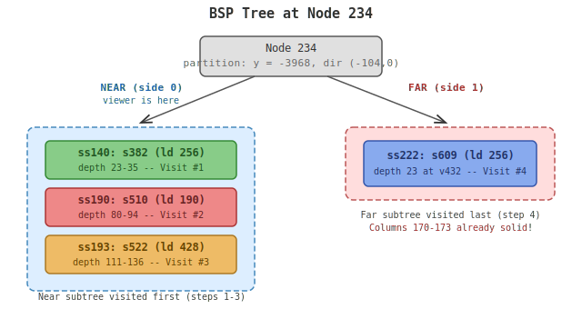
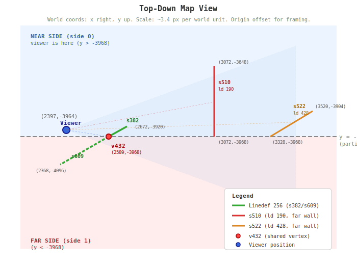
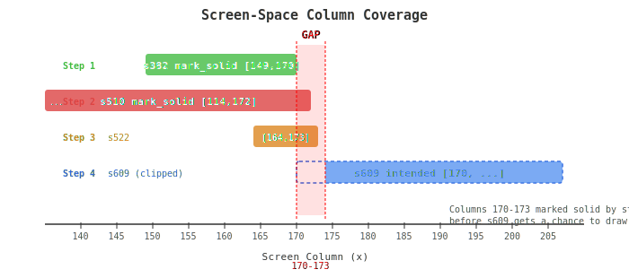
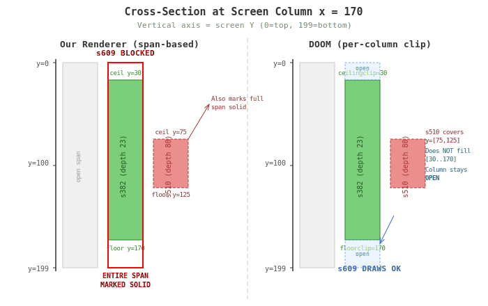

# BSP Crack at Vertex v432: Analysis and Root Cause

**Date:** 2026-04-11
**Position:** (2397, -3964), angle 14
**Affected linedef:** 256
**Symptom:** 4-pixel gap ("crack") at columns 170-173

---

## 1. Problem Statement

Linedef 256 is split by the BSP into two sub-segs that are rendered in
widely separated traversal positions:

| Seg  | Subsector | BSP visit position | Depth at v432 |
|------|-----------|--------------------|----------------|
| s382 | ss140     | 0/14 (first)       | 23-35          |
| s609 | ss222     | 13/14 (near-last)  | 23 at v432     |

Both segs share vertex v432 = (2589, -3968), which projects to screen
column sx = 170. Between their visit times, far-field solid walls s510
(linedef 190, depth 80-94) and s522 (linedef 428, depth 111-136) call
`mark_solid` on columns 170-173, blocking s609 from drawing there.

The result is a 4-pixel crack in what should be a continuous wall.

---

## 2. BSP Structure at Node 234

Node 234's partition line is **horizontal at y = -3968** with direction
(-104, 0). The viewer at (2397, -3964) is 4 units north (dy = +4),
placing it on **side 0** (near).

Vertex v432 = (2589, -3968) sits **exactly on** the partition line.

- **s382** extends north from v432 into the near half-space.
- **s609** extends south from v432 to (2368, -4096) in the far half-space.

The near subtree contains:
- **ss140** -- s382 (the near portion of linedef 256)
- **ss190** -- s510 (linedef 190, world coords (3072,-3648) to (3072,-3968))
- **ss193** -- s522 (linedef 428, world coords (3520,-3904) to (3328,-3968))

The far subtree contains:
- **ss222** -- s609 (the far portion of linedef 256)

### BSP Tree Structure



<!--
<svg xmlns="http://www.w3.org/2000/svg" viewBox="0 0 640 340" font-family="monospace" font-size="13">
  <defs>
    <marker id="arrow-tree" markerWidth="8" markerHeight="6" refX="8" refY="3" orient="auto">
      <path d="M0,0 L8,3 L0,6" fill="none" stroke="#333" stroke-width="1.2"/>
    </marker>
  </defs>

  <!-- Title -->
  <text x="320" y="20" text-anchor="middle" font-size="15" font-weight="bold" fill="#333">BSP Tree at Node 234</text>

  <!-- Root node -->
  <rect x="220" y="40" width="200" height="44" rx="6" fill="#e0e0e0" stroke="#555" stroke-width="1.5"/>
  <text x="320" y="57" text-anchor="middle" font-size="12" fill="#333">Node 234</text>
  <text x="320" y="73" text-anchor="middle" font-size="11" fill="#666">partition: y = -3968, dir (-104,0)</text>

  <!-- Near branch label -->
  <text x="155" y="100" text-anchor="middle" font-size="11" fill="#2266aa" font-weight="bold">NEAR (side 0)</text>
  <text x="155" y="114" text-anchor="middle" font-size="10" fill="#2266aa">viewer is here</text>

  <!-- Far branch label -->
  <text x="490" y="100" text-anchor="middle" font-size="11" fill="#aa3333" font-weight="bold">FAR (side 1)</text>

  <!-- Lines from root -->
  <line x1="280" y1="84" x2="155" y2="135" stroke="#555" stroke-width="1.5" marker-end="url(#arrow-tree)"/>
  <line x1="360" y1="84" x2="490" y2="135" stroke="#555" stroke-width="1.5" marker-end="url(#arrow-tree)"/>

  <!-- Near subtree box -->
  <rect x="30" y="140" width="250" height="180" rx="8" fill="#ddeeff" stroke="#4488bb" stroke-width="1.5" stroke-dasharray="6,3"/>

  <!-- ss140 -->
  <rect x="50" y="155" width="210" height="42" rx="5" fill="#88cc88" stroke="#338833" stroke-width="1.5"/>
  <text x="155" y="172" text-anchor="middle" font-size="12" font-weight="bold" fill="#225522">ss140: s382 (ld 256)</text>
  <text x="155" y="188" text-anchor="middle" font-size="10" fill="#225522">depth 23-35 -- Visit #1</text>

  <!-- ss190 -->
  <rect x="50" y="207" width="210" height="42" rx="5" fill="#ee8888" stroke="#aa3333" stroke-width="1.5"/>
  <text x="155" y="224" text-anchor="middle" font-size="12" font-weight="bold" fill="#662222">ss190: s510 (ld 190)</text>
  <text x="155" y="240" text-anchor="middle" font-size="10" fill="#662222">depth 80-94 -- Visit #2</text>

  <!-- ss193 -->
  <rect x="50" y="259" width="210" height="42" rx="5" fill="#eebb66" stroke="#aa7722" stroke-width="1.5"/>
  <text x="155" y="276" text-anchor="middle" font-size="12" font-weight="bold" fill="#664400">ss193: s522 (ld 428)</text>
  <text x="155" y="292" text-anchor="middle" font-size="10" fill="#664400">depth 111-136 -- Visit #3</text>

  <!-- Far subtree box -->
  <rect x="380" y="140" width="230" height="80" rx="8" fill="#ffdddd" stroke="#bb5555" stroke-width="1.5" stroke-dasharray="6,3"/>

  <!-- ss222 -->
  <rect x="400" y="155" width="190" height="50" rx="5" fill="#88aaee" stroke="#3355aa" stroke-width="1.5"/>
  <text x="495" y="175" text-anchor="middle" font-size="12" font-weight="bold" fill="#223366">ss222: s609 (ld 256)</text>
  <text x="495" y="192" text-anchor="middle" font-size="10" fill="#223366">depth 23 at v432 -- Visit #4</text>

  <!-- Annotations -->
  <text x="155" y="330" text-anchor="middle" font-size="10" fill="#444">Near subtree visited first (steps 1-3)</text>
  <text x="495" y="240" text-anchor="middle" font-size="10" fill="#444">Far subtree visited last (step 4)</text>
  <text x="495" y="254" text-anchor="middle" font-size="10" fill="#aa3333">Columns 170-173 already solid!</text>
</svg>
-->

---

## 3. BSP Traversal Order (Detail)

| Step | Subsector | Seg  | Action                         | Solid columns after |
|------|-----------|------|--------------------------------|---------------------|
| 1    | ss140     | s382 | draw wall, mark_solid [149,170] | ...149-170...       |
| 2    | ss190     | s510 | draw wall, mark_solid [114,172] | ...114-173...       |
| 3    | ss193     | s522 | draw wall, mark_solid [164,173] | ...114-173...       |
| 4    | ss222     | s609 | **clipped** to x >= 174        | (columns 170-173 lost) |

Screen-space ceiling endpoints confirm:

```
s382 ceiling: (149,48) -> (170,30)     right edge at x=170
s609 ceiling: (174,27) -> (207,0)      left edge at x=174  (4px gap!)
```

Both segs share v432 projecting to sx=170. The expected left edge of s609
is x=170, but `draw_clipped` sees the span starting at x=174 and clips
accordingly.

---

## 4. Top-Down Map View



<!--
<svg xmlns="http://www.w3.org/2000/svg" viewBox="0 0 700 520" font-family="monospace" font-size="12">
  <defs>
    <marker id="arrow-map" markerWidth="8" markerHeight="6" refX="8" refY="3" orient="auto">
      <path d="M0,0 L8,3 L0,6" fill="none" stroke="#333" stroke-width="1"/>
    </marker>
  </defs>

  <!-- Title -->
  <text x="350" y="22" text-anchor="middle" font-size="15" font-weight="bold" fill="#333">Top-Down Map View</text>

  <!-- Coordinate note -->
  <text x="350" y="42" text-anchor="middle" font-size="10" fill="#888">World coords: x right, y up. Scale: ~3.4 px per world unit. Origin offset for framing.</text>

  <!-- Half-space fills -->
  <!-- Near side (north, y > -3968) = light blue -->
  <rect x="40" y="50" width="620" height="218" fill="#ddeeff" opacity="0.5"/>
  <!-- Far side (south, y < -3968) = light red -->
  <rect x="40" y="268" width="620" height="220" fill="#ffdddd" opacity="0.5"/>

  <!-- Side labels -->
  <text x="60" y="75" font-size="11" fill="#3366aa" font-weight="bold">NEAR SIDE (side 0)</text>
  <text x="60" y="88" font-size="10" fill="#3366aa">viewer is here (y > -3968)</text>
  <text x="60" y="476" font-size="11" fill="#aa3333" font-weight="bold">FAR SIDE (side 1)</text>
  <text x="60" y="489" font-size="10" fill="#aa3333">(y &lt; -3968)</text>

  <!-- Partition line at y=-3968 (maps to svg y=268) -->
  <line x1="40" y1="268" x2="660" y2="268" stroke="#888" stroke-width="2" stroke-dasharray="8,4"/>
  <text x="665" y="272" font-size="11" fill="#888" text-anchor="start">y = -3968</text>
  <text x="665" y="286" font-size="10" fill="#888" text-anchor="start">(partition)</text>

  <!--
    Coordinate mapping (approximate):
    World x: 2300..3600 -> SVG x: 70..630  (scale: ~0.43 px/unit ... let's use 0.43)
    World y: -4100..-3600 -> SVG y: 488..50  (y inverted, scale: ~0.876 px/unit)

    Actually let me define a simpler mapping:
    SVG_x = (world_x - 2200) * 0.45 + 40
    SVG_y = (-3600 - world_y) * 0.876 + 50

    Viewer (2397,-3964): SVG (128.65, 369.0-... )
    Let me recalculate with a cleaner mapping:

    SVG_x = (world_x - 2200) * 0.43 + 60
    SVG_y = (world_y + 3600) * (-0.85) + 50
    Hmm, let me just place things manually for clarity.

    Key points:
    Viewer:     (2397, -3964)
    v432:       (2589, -3968)
    ld256 north end: (2672, -3920)
    ld256 south end: (2368, -4096)
    s510 start: (3072, -3648)
    s510 end:   (3072, -3968)
    s522 start: (3520, -3904)
    s522 end:   (3328, -3968)

    Manual placement (SVG coords):
    Viewer:         (130, 255)
    v432:           (213, 268)
    ld256 north:    (249, 248)
    ld256 south:    (118, 323)
    s510 top:       (420, 130)
    s510 bottom:    (420, 268)
    s522 start:     (613, 218)
    s522 end:       (530, 268)
  -->

  <!-- Viewer position -->
  <circle cx="130" cy="255" r="7" fill="#3366dd" stroke="#1a1a88" stroke-width="2"/>
  <text x="118" y="245" font-size="11" fill="#1a1a88" font-weight="bold">Viewer</text>
  <text x="80" y="232" font-size="10" fill="#555">(2397,-3964)</text>

  <!-- FOV cone (approximate 90-degree cone facing east/right) -->
  <polygon points="130,255 580,90 580,420" fill="#3366dd" opacity="0.06" stroke="#3366dd" stroke-width="0.5" stroke-dasharray="4,3"/>

  <!-- Linedef 256: (2672,-3920) through v432=(2589,-3968) to (2368,-4096) -->
  <!-- s382: (2672,-3920) to v432=(2589,-3968) — NEAR side, green -->
  <line x1="249" y1="248" x2="213" y2="268" stroke="#33aa33" stroke-width="3.5"/>
  <text x="248" y="240" font-size="10" fill="#227722" font-weight="bold">s382</text>
  <text x="264" y="252" font-size="9" fill="#555">(2672,-3920)</text>

  <!-- s609: v432=(2589,-3968) to (2368,-4096) — FAR side, green/blue -->
  <line x1="213" y1="268" x2="118" y2="323" stroke="#33aa33" stroke-width="3.5" stroke-dasharray="6,3"/>
  <text x="140" y="310" font-size="10" fill="#227722" font-weight="bold">s609</text>
  <text x="70" y="338" font-size="9" fill="#555">(2368,-4096)</text>

  <!-- v432 vertex marker -->
  <circle cx="213" cy="268" r="5" fill="#ff4444" stroke="#aa0000" stroke-width="2"/>
  <text x="218" y="290" font-size="11" fill="#aa0000" font-weight="bold">v432</text>
  <text x="218" y="302" font-size="9" fill="#aa0000">(2589,-3968)</text>

  <!-- s510: (3072,-3648) to (3072,-3968) — vertical wall, red -->
  <line x1="420" y1="130" x2="420" y2="268" stroke="#dd3333" stroke-width="3"/>
  <text x="428" y="165" font-size="10" fill="#aa2222" font-weight="bold">s510</text>
  <text x="428" y="178" font-size="9" fill="#aa2222">ld 190</text>
  <text x="428" y="125" font-size="9" fill="#555">(3072,-3648)</text>
  <text x="428" y="282" font-size="9" fill="#555">(3072,-3968)</text>

  <!-- s522: (3520,-3904) to (3328,-3968) — diagonal wall, orange -->
  <line x1="613" y1="218" x2="530" y2="268" stroke="#dd8822" stroke-width="3"/>
  <text x="575" y="212" font-size="10" fill="#aa6600" font-weight="bold">s522</text>
  <text x="575" y="225" font-size="9" fill="#aa6600">ld 428</text>
  <text x="618" y="212" font-size="9" fill="#555">(3520,-3904)</text>
  <text x="534" y="282" font-size="9" fill="#555">(3328,-3968)</text>

  <!-- Sight lines from viewer to key points -->
  <line x1="130" y1="255" x2="213" y2="268" stroke="#3366dd" stroke-width="0.8" stroke-dasharray="3,3" opacity="0.5"/>
  <line x1="130" y1="255" x2="420" y2="200" stroke="#dd3333" stroke-width="0.8" stroke-dasharray="3,3" opacity="0.4"/>
  <line x1="130" y1="255" x2="570" y2="240" stroke="#dd8822" stroke-width="0.8" stroke-dasharray="3,3" opacity="0.4"/>

  <!-- Legend -->
  <rect x="440" y="370" width="210" height="120" rx="5" fill="white" stroke="#ccc" stroke-width="1"/>
  <text x="455" y="388" font-size="11" font-weight="bold" fill="#333">Legend</text>
  <line x1="455" y1="403" x2="480" y2="403" stroke="#33aa33" stroke-width="3"/>
  <text x="488" y="407" font-size="10" fill="#333">Linedef 256 (s382/s609)</text>
  <line x1="455" y1="423" x2="480" y2="423" stroke="#dd3333" stroke-width="3"/>
  <text x="488" y="427" font-size="10" fill="#333">s510 (ld 190, far wall)</text>
  <line x1="455" y1="443" x2="480" y2="443" stroke="#dd8822" stroke-width="3"/>
  <text x="488" y="447" font-size="10" fill="#333">s522 (ld 428, far wall)</text>
  <circle cx="467" cy="463" r="4" fill="#ff4444" stroke="#aa0000" stroke-width="1.5"/>
  <text x="488" y="467" font-size="10" fill="#333">v432 (shared vertex)</text>
  <circle cx="467" cy="480" r="4" fill="#3366dd" stroke="#1a1a88" stroke-width="1.5"/>
  <text x="488" y="484" font-size="10" fill="#333">Viewer position</text>
</svg>

-->

The critical geometry: s510 and s522 are far-field walls that happen to
fall in the **near** subtree (they are north of y = -3968). They are
visited in steps 2 and 3, long before the far subtree's s609 at step 4.
From the viewer's perspective, s510 and s522 are far away (depth 80-136)
while linedef 256 at v432 is nearby (depth 23), but the BSP visit order
does not guarantee depth ordering across subtree boundaries.

---

## 5. Screen-Space Column Diagram



<!--
<svg xmlns="http://www.w3.org/2000/svg" viewBox="0 0 700 310" font-family="monospace" font-size="12">
  <!-- Title -->
  <text x="350" y="22" text-anchor="middle" font-size="15" font-weight="bold" fill="#333">Screen-Space Column Coverage</text>

  <!-- X axis -->
  <line x1="50" y1="250" x2="650" y2="250" stroke="#333" stroke-width="1.5"/>

  <!-- Tick marks and labels every 5 columns from 140 to 210 -->
  <!-- Scale: column x maps to SVG_x = (x - 135) * 8 + 50 -->
  <!-- 140->90, 145->130, 150->170, 155->210, 160->250, 165->290, 170->330, 175->370, 180->410, 185->450, 190->490, 195->530, 200->570, 205->610, 210->650 -->

  <line x1="90" y1="248" x2="90" y2="255" stroke="#333" stroke-width="1"/>
  <text x="90" y="267" text-anchor="middle" font-size="10" fill="#555">140</text>

  <line x1="130" y1="248" x2="130" y2="255" stroke="#333" stroke-width="1"/>
  <text x="130" y="267" text-anchor="middle" font-size="10" fill="#555">145</text>

  <line x1="170" y1="248" x2="170" y2="255" stroke="#333" stroke-width="1"/>
  <text x="170" y="267" text-anchor="middle" font-size="10" fill="#555">150</text>

  <line x1="210" y1="248" x2="210" y2="255" stroke="#333" stroke-width="1"/>
  <text x="210" y="267" text-anchor="middle" font-size="10" fill="#555">155</text>

  <line x1="250" y1="248" x2="250" y2="255" stroke="#333" stroke-width="1"/>
  <text x="250" y="267" text-anchor="middle" font-size="10" fill="#555">160</text>

  <line x1="290" y1="248" x2="290" y2="255" stroke="#333" stroke-width="1"/>
  <text x="290" y="267" text-anchor="middle" font-size="10" fill="#555">165</text>

  <line x1="330" y1="248" x2="330" y2="255" stroke="#333" stroke-width="1"/>
  <text x="330" y="267" text-anchor="middle" font-size="10" fill="#555">170</text>

  <line x1="370" y1="248" x2="370" y2="255" stroke="#333" stroke-width="1"/>
  <text x="370" y="267" text-anchor="middle" font-size="10" fill="#555">175</text>

  <line x1="410" y1="248" x2="410" y2="255" stroke="#333" stroke-width="1"/>
  <text x="410" y="267" text-anchor="middle" font-size="10" fill="#555">180</text>

  <line x1="450" y1="248" x2="450" y2="255" stroke="#333" stroke-width="1"/>
  <text x="450" y="267" text-anchor="middle" font-size="10" fill="#555">185</text>

  <line x1="490" y1="248" x2="490" y2="255" stroke="#333" stroke-width="1"/>
  <text x="490" y="267" text-anchor="middle" font-size="10" fill="#555">190</text>

  <line x1="530" y1="248" x2="530" y2="255" stroke="#333" stroke-width="1"/>
  <text x="530" y="267" text-anchor="middle" font-size="10" fill="#555">195</text>

  <line x1="570" y1="248" x2="570" y2="255" stroke="#333" stroke-width="1"/>
  <text x="570" y="267" text-anchor="middle" font-size="10" fill="#555">200</text>

  <line x1="610" y1="248" x2="610" y2="255" stroke="#333" stroke-width="1"/>
  <text x="610" y="267" text-anchor="middle" font-size="10" fill="#555">205</text>

  <text x="350" y="290" text-anchor="middle" font-size="11" fill="#333">Screen Column (x)</text>

  <!-- Step 1: s382 mark_solid [149,170] — green bar -->
  <!-- 149 -> (149-135)*8+50 = 162,  170 -> 330 -->
  <rect x="162" y="60" width="168" height="24" rx="3" fill="#44bb44" opacity="0.8"/>
  <text x="246" y="77" text-anchor="middle" font-size="11" fill="white" font-weight="bold">s382 mark_solid [149,170]</text>
  <text x="70" y="77" font-size="10" fill="#44bb44" font-weight="bold">Step 1</text>

  <!-- Step 2: s510 mark_solid [114,172] — red bar (show from 140 area) -->
  <!-- 114 -> (114-135)*8+50 = -118, clip to 50.  172 -> (172-135)*8+50 = 346 -->
  <rect x="50" y="100" width="296" height="24" rx="3" fill="#dd4444" opacity="0.8"/>
  <text x="198" y="117" text-anchor="middle" font-size="11" fill="white" font-weight="bold">s510 mark_solid [114,172]</text>
  <text x="55" y="117" font-size="9" fill="white">...</text>
  <text x="70" y="117" font-size="10" fill="#dd4444" font-weight="bold">Step 2</text>

  <!-- Step 3: s522 mark_solid [164,173] — orange bar -->
  <!-- 164 -> (164-135)*8+50 = 282,  173 -> (173-135)*8+50 = 354 -->
  <rect x="282" y="140" width="72" height="24" rx="3" fill="#dd8822" opacity="0.8"/>
  <text x="318" y="157" text-anchor="middle" font-size="10" fill="white" font-weight="bold">[164,173]</text>
  <text x="70" y="157" font-size="10" fill="#dd8822" font-weight="bold">Step 3</text>
  <text x="120" y="157" font-size="10" fill="#dd8822">s522</text>

  <!-- Step 4: s609 intended [170,207+] — blue bar, but clipped to [174,...] -->
  <!-- Intended start: 170 -> 330, Actual start: 174 -> (174-135)*8+50 = 362,  207 -> (207-135)*8+50 = 626 -->
  <!-- Show intended range as dashed -->
  <rect x="330" y="180" width="296" height="24" rx="3" fill="none" stroke="#3366dd" stroke-width="1.5" stroke-dasharray="4,3"/>
  <text x="478" y="197" text-anchor="middle" font-size="11" fill="#3366dd">s609 intended [170, ...]</text>
  <!-- Show actual range as solid -->
  <rect x="362" y="180" width="264" height="24" rx="3" fill="#4488ee" opacity="0.7"/>
  <text x="70" y="197" font-size="10" fill="#3366dd" font-weight="bold">Step 4</text>
  <text x="120" y="197" font-size="10" fill="#3366dd">s609 (clipped)</text>

  <!-- THE GAP highlight -->
  <rect x="330" y="50" width="32" height="190" rx="0" fill="#ff0000" opacity="0.12"/>
  <line x1="330" y1="46" x2="330" y2="244" stroke="#ff0000" stroke-width="1" stroke-dasharray="3,2"/>
  <line x1="362" y1="46" x2="362" y2="244" stroke="#ff0000" stroke-width="1" stroke-dasharray="3,2"/>
  <text x="346" y="43" text-anchor="middle" font-size="12" fill="#ff0000" font-weight="bold">GAP</text>
  <text x="346" y="300" text-anchor="middle" font-size="10" fill="#ff0000">170-173</text>

  <!-- Annotation: what happened -->
  <text x="500" y="237" font-size="10" fill="#555">Columns 170-173 marked solid by steps 2-3</text>
  <text x="500" y="250" font-size="10" fill="#555">before s609 gets a chance to draw at step 4</text>
</svg>
-->

---

## 6. Cross-Section at Screen Column x=170

This diagram shows why DOOM's per-column clip approach avoids the crack,
while our span-based `mark_solid` causes it.



<!--
<svg xmlns="http://www.w3.org/2000/svg" viewBox="0 0 700 440" font-family="monospace" font-size="12">
  <!-- Title -->
  <text x="350" y="22" text-anchor="middle" font-size="15" font-weight="bold" fill="#333">Cross-Section at Screen Column x = 170</text>
  <text x="350" y="40" text-anchor="middle" font-size="11" fill="#888">Vertical axis = screen Y (0=top, 199=bottom)</text>

  <!-- ==================== LEFT PANEL: Our span-based approach ==================== -->
  <text x="185" y="68" text-anchor="middle" font-size="13" font-weight="bold" fill="#333">Our Renderer (span-based)</text>

  <!-- Vertical axis for left panel -->
  <line x1="80" y1="85" x2="80" y2="390" stroke="#333" stroke-width="1.5"/>
  <text x="70" y="95" text-anchor="end" font-size="10" fill="#555">y=0</text>
  <text x="70" y="238" text-anchor="end" font-size="10" fill="#555">y=100</text>
  <text x="70" y="390" text-anchor="end" font-size="10" fill="#555">y=199</text>

  <!-- Tick marks -->
  <line x1="76" y1="90" x2="80" y2="90" stroke="#333" stroke-width="1"/>
  <line x1="76" y1="238" x2="80" y2="238" stroke="#333" stroke-width="1"/>
  <line x1="76" y1="385" x2="80" y2="385" stroke="#333" stroke-width="1"/>

  <!-- Full open span initially: y 0-199 (SVG 90-385) -->
  <rect x="90" y="90" width="50" height="295" rx="0" fill="#f0f0f0" stroke="#ccc" stroke-width="1"/>
  <text x="115" y="240" text-anchor="middle" font-size="9" fill="#999" transform="rotate(-90,115,240)">open span</text>

  <!-- Step 1: s382 draws, mark_solid. Show the near wall covering a LARGE range -->
  <!-- s382 at depth 23: ceiling ~y=30, floor ~y=170 => SVG roughly 135, 347 -->
  <rect x="155" y="115" width="50" height="230" rx="0" fill="#44bb44" opacity="0.7" stroke="#338833" stroke-width="1.5"/>
  <text x="180" y="240" text-anchor="middle" font-size="10" fill="#225522" transform="rotate(-90,180,240)">s382 (depth 23)</text>
  <text x="180" y="108" text-anchor="middle" font-size="9" fill="#338833">ceil y=30</text>
  <text x="180" y="360" text-anchor="middle" font-size="9" fill="#338833">floor y=170</text>

  <!-- After s382 mark_solid at [149,170], this column is now in the solid set -->
  <!-- Entire column marked solid (span approach) -->
  <rect x="155" y="90" width="50" height="295" rx="0" fill="none" stroke="#ff0000" stroke-width="2"/>
  <text x="180" y="400" text-anchor="middle" font-size="10" fill="#ff0000" font-weight="bold">ENTIRE SPAN</text>
  <text x="180" y="413" text-anchor="middle" font-size="10" fill="#ff0000" font-weight="bold">MARKED SOLID</text>

  <!-- Step 2: s510 also marks solid (redundant here, but extends the solid range) -->
  <!-- s510 at depth 80-94: much narrower projected range, say ceil y=75, floor y=125 => SVG 200, 270 -->
  <rect x="220" y="200" width="50" height="70" rx="0" fill="#dd4444" opacity="0.6" stroke="#aa3333" stroke-width="1.5" stroke-dasharray="4,2"/>
  <text x="245" y="240" text-anchor="middle" font-size="10" fill="#aa3333" transform="rotate(-90,245,240)">s510 (depth 80)</text>
  <text x="245" y="193" text-anchor="middle" font-size="9" fill="#aa3333">ceil y=75</text>
  <text x="245" y="283" text-anchor="middle" font-size="9" fill="#aa3333">floor y=125</text>

  <!-- Arrow showing that s510's mark_solid kills the entire span too -->
  <line x1="270" y1="200" x2="300" y2="150" stroke="#aa3333" stroke-width="1" marker-end="url(#arrow-xsec)"/>
  <text x="303" y="145" font-size="9" fill="#aa3333">Also marks full</text>
  <text x="303" y="157" font-size="9" fill="#aa3333">span solid</text>

  <!-- Step 4 annotation: s609 BLOCKED -->
  <text x="180" y="80" text-anchor="middle" font-size="11" fill="#ff0000" font-weight="bold">s609 BLOCKED</text>

  <!-- ==================== RIGHT PANEL: DOOM's per-column approach ==================== -->
  <text x="530" y="68" text-anchor="middle" font-size="13" font-weight="bold" fill="#333">DOOM (per-column clip)</text>

  <defs>
    <marker id="arrow-xsec" markerWidth="8" markerHeight="6" refX="8" refY="3" orient="auto">
      <path d="M0,0 L8,3 L0,6" fill="none" stroke="#aa3333" stroke-width="1"/>
    </marker>
    <marker id="arrow-ok" markerWidth="8" markerHeight="6" refX="8" refY="3" orient="auto">
      <path d="M0,0 L8,3 L0,6" fill="none" stroke="#3366dd" stroke-width="1"/>
    </marker>
  </defs>

  <!-- Vertical axis for right panel -->
  <line x1="420" y1="85" x2="420" y2="390" stroke="#333" stroke-width="1.5"/>
  <text x="410" y="95" text-anchor="end" font-size="10" fill="#555">y=0</text>
  <text x="410" y="238" text-anchor="end" font-size="10" fill="#555">y=100</text>
  <text x="410" y="390" text-anchor="end" font-size="10" fill="#555">y=199</text>

  <line x1="416" y1="90" x2="420" y2="90" stroke="#333" stroke-width="1"/>
  <line x1="416" y1="238" x2="420" y2="238" stroke="#333" stroke-width="1"/>
  <line x1="416" y1="385" x2="420" y2="385" stroke="#333" stroke-width="1"/>

  <!-- Full open span initially -->
  <rect x="430" y="90" width="50" height="295" rx="0" fill="#f0f0f0" stroke="#ccc" stroke-width="1"/>

  <!-- Step 1: s382 draws its wall portion and updates clip arrays -->
  <rect x="495" y="115" width="50" height="230" rx="0" fill="#44bb44" opacity="0.7" stroke="#338833" stroke-width="1.5"/>
  <text x="520" y="240" text-anchor="middle" font-size="10" fill="#225522" transform="rotate(-90,520,240)">s382 (depth 23)</text>
  <text x="520" y="108" text-anchor="middle" font-size="9" fill="#338833">ceilingclip=30</text>
  <text x="520" y="360" text-anchor="middle" font-size="9" fill="#338833">floorclip=170</text>

  <!-- Per-column: only the drawn range is clipped. Open above ceil and below floor -->
  <!-- Open range above: y 0-30 -->
  <rect x="495" y="90" width="50" height="25" rx="0" fill="#ddeeff" opacity="0.6" stroke="#4488bb" stroke-width="1" stroke-dasharray="3,2"/>
  <text x="520" y="101" text-anchor="middle" font-size="8" fill="#4488bb">open</text>

  <!-- Open range below: y 170-199 -->
  <rect x="495" y="345" width="50" height="40" rx="0" fill="#ddeeff" opacity="0.6" stroke="#4488bb" stroke-width="1" stroke-dasharray="3,2"/>
  <text x="520" y="368" text-anchor="middle" font-size="8" fill="#4488bb">open</text>

  <!-- Step 2: s510 draws its narrow range and updates clip arrays -->
  <rect x="560" y="200" width="50" height="70" rx="0" fill="#dd4444" opacity="0.6" stroke="#aa3333" stroke-width="1.5" stroke-dasharray="4,2"/>
  <text x="585" y="240" text-anchor="middle" font-size="10" fill="#aa3333" transform="rotate(-90,585,240)">s510 (depth 80)</text>

  <!-- Per-column: s510 does NOT cover the full range [30..170] -->
  <!-- It only covers [75..125]. So it does NOT mark column as fully solid -->
  <text x="610" y="193" font-size="9" fill="#aa3333">s510 covers</text>
  <text x="610" y="205" font-size="9" fill="#aa3333">y=[75,125]</text>
  <text x="610" y="220" font-size="9" fill="#2266aa">Does NOT fill</text>
  <text x="610" y="232" font-size="9" fill="#2266aa">[30..170]</text>
  <text x="610" y="247" font-size="9" fill="#2266aa">Column stays</text>
  <text x="610" y="259" font-size="9" fill="#2266aa" font-weight="bold">OPEN</text>

  <!-- Step 4: s609 CAN draw here in DOOM -->
  <line x1="565" y1="310" x2="545" y2="350" stroke="#3366dd" stroke-width="1" marker-end="url(#arrow-ok)"/>
  <text x="530" y="390" text-anchor="middle" font-size="11" fill="#3366dd" font-weight="bold">s609 DRAWS OK</text>

  <!-- Dividing line between panels -->
  <line x1="355" y1="55" x2="355" y2="430" stroke="#ccc" stroke-width="1" stroke-dasharray="6,4"/>
</svg>
-->

**The key insight:** At column 170, s510 (the far wall at depth 80)
projects to a narrow vertical range (roughly y = 75 to y = 125). The near
wall s382 already drew from y = 30 to y = 170.

- **DOOM's per-column approach:** s510's projected range [75,125] does not
  cover the full remaining open range [ceiling_clip=30 .. floor_clip=170].
  The column is NOT marked solid. When s609 arrives, it can still draw.

- **Our span-based approach:** `mark_solid([170,173])` marks the entire
  horizontal span as solid, regardless of the vertical coverage. When s609
  arrives, columns 170-173 are gone.

---

## 7. Why the BSP Ordering Creates This Situation

The BSP node 234 splits at y = -3968. The viewer is 4 units north. The
near subtree is visited first. Both the nearby s382 **and** the far-field
walls s510/s522 happen to be in the near subtree (their geometry is north
of y = -3968).

```
Near subtree visit order:
  ss140 (s382)  -- nearby wall, depth 23-35, correct to draw
  ss190 (s510)  -- far wall,   depth 80-94, marks solid broadly
  ss193 (s522)  -- far wall,   depth 111-136, extends solid further

Then far subtree:
  ss222 (s609)  -- nearby wall, depth 23 at v432 -- BLOCKED
```

The BSP guarantees that within each subtree, nearer geometry is visited
before farther geometry **for the half-space the viewer is in**. It does
NOT guarantee that ALL near geometry is visited before any far geometry
across the tree as a whole. In this case, s510 and s522 are far away
from the viewer but are in the near subtree because their world geometry
is north of the partition line.

---

## 8. Summary

### Root Cause

The crack is caused by the interaction of two factors:

1. **BSP split at v432**: Linedef 256 is split into s382 (near subtree)
   and s609 (far subtree). They share vertex v432 which projects to
   screen column 170.

2. **Over-marking by span-based `mark_solid`**: Far-field walls s510 and
   s522, which live in the near subtree, call `mark_solid` on columns
   170-173. Our `EndpointClipSpans` implementation marks these columns
   as fully solid (removing the entire span), even though the far walls'
   projected height covers only a small fraction of the visible vertical
   range at those columns. By the time s609 is visited in the far
   subtree, columns 170-173 are closed.

### Why Original DOOM Does Not Exhibit This

DOOM's renderer uses per-column ceiling/floor clip arrays. A solid wall
only marks a column as "fully solid" when its projected floor-to-ceiling
range covers the **entire** remaining open range at that column. A far
wall at depth 80+ projects to a narrow height band that does not fill the
full open range, so the column remains partially open for nearer geometry
to draw into later.

### Potential Fixes

1. **Per-column vertical clip tracking**: Track ceiling and floor clip
   values per screen column (as DOOM does). Only mark a column solid when
   a wall's projected range covers from `ceilingclip[x]` to
   `floorclip[x]`. This is the correct and complete fix but requires
   per-column state (320 bytes for ceiling + 320 bytes for floor on a
   320-column display, or proportionally less for our resolution).

2. **Height-aware span marking**: Before calling `mark_solid`, check
   whether the wall's projected height at each endpoint actually fills
   the full vertical open range. Only mark solid the sub-range of columns
   where it does. This is a compromise that avoids full per-column arrays
   but adds per-`mark_solid` computation.

3. **Deferred solid marking**: Do not mark spans solid during the initial
   BSP walk. Instead, record all solid-wall segments and resolve
   occlusion in a second pass with depth awareness. This trades memory
   for correctness but changes the rendering architecture significantly.

4. **BSP node annotation**: Pre-compute at BSP build time which solid
   walls can safely mark spans (i.e., those that are genuinely occluding
   from any viewpoint within the node's region). This is complex and may
   not generalize.

Fix (1) is what the original engine does and is the most proven approach.
Fix (2) may be practical for a constrained platform if full per-column
arrays are too expensive.
