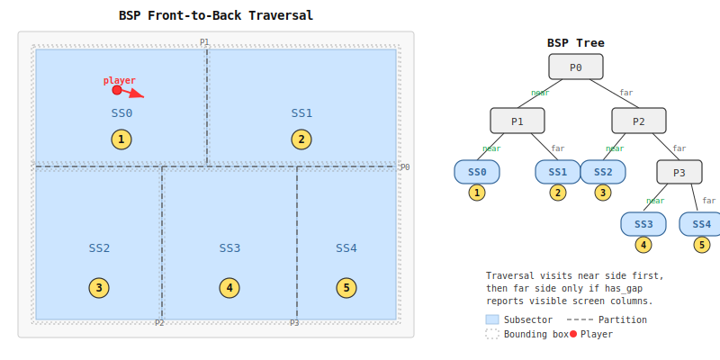

# BSP Walk -- Technical Documentation

## 1. Overview

The DOOM wireframe renderer traverses a Binary Space Partition (BSP) tree to
draw wall segments in strict front-to-back order. This ordering is essential:
it allows the clipper to maintain a set of visibility spans that shrink
monotonically as nearer geometry occludes farther geometry, enabling early
pruning of invisible subtrees.

### 1.1 BSP Tree Structure

The BSP tree is a binary tree where each **node** contains:

- A **partition line** defined by a point (x, y) and a direction vector (dx, dy).
  The partition line divides the map plane into two half-spaces.
- A **right child** (front / side 0) and a **left child** (back / side 1).
- A **bounding box** for each child subtree (top, bottom, left, right in map
  coordinates).

Leaf nodes are **subsectors**: convex regions of the map that each contain a
list of **segs** (wall segments). Every seg is a fragment of a linedef clipped
to the subsector boundary.

```
                    Node 238
                   /         \
            Node 237         Node 215
           /       \        /       \
       SS 103    Node 201  SS 88   Node 180
                 /    \            /    \
              SS 99  SS 100    SS 72  SS 73
```

### 1.2 Front-to-Back Traversal

The traversal determines which side of each partition line the player stands
on using `point_on_side`. The near side (containing the player) is visited
first, guaranteeing that closer geometry is drawn before farther geometry.
After visiting the near subtree, the far subtree is visited only if its
bounding box projects to a screen region that still has visible gaps.

### 1.3 Data Flow Summary

```
BSP node
  |
  +-- point_on_side --> near side first
  |
  +-- near child --> recurse (or render subsector)
  |
  +-- far child bbox --> fp_bbox_visible_fixed
  |                        |
  |                        +--> (min_sx, max_sx) or None
  |                        |
  |                        +--> has_gap check against clip spans
  |
  +-- far child --> recurse only if has_gap is true
```

## 2. Node Format

### 2.1 WAD Node Record (Python)

Each node parsed from the WAD is a 14-element tuple:

| Index | Field  | Type | Description                          |
|-------|--------|------|--------------------------------------|
| 0     | x      | s16  | Partition line origin X              |
| 1     | y      | s16  | Partition line origin Y              |
| 2     | dx     | s16  | Partition line direction X           |
| 3     | dy     | s16  | Partition line direction Y           |
| 4-7   | r_bbox | s16  | Right child bounding box (top, bottom, left, right) |
| 8-11  | l_bbox | s16  | Left child bounding box (top, bottom, left, right)  |
| 12    | r_child| u16  | Right child ID                       |
| 13    | l_child| u16  | Left child ID                        |

### 2.2 Packed Node Record (ROM)

The `wad_packed.py` module packs nodes into a flat byte array at `NODE_SIZE =
16` bytes per node (shift 4 for fast address computation). The packed layout
in `rom_main` is:

```
Offset  Size  Field
  +0    s16   nx     partition X, relative to map_center_x (raw, not prescaled)
  +2    s16   ny     partition Y, relative to map_center_y (raw, not prescaled)
  +4    s16   dx     partition direction X (raw)
  +6    s16   dy     partition direction Y (raw)
  +8    u16   r_child  right child ID
 +10    u16   l_child  left child ID
 +12    4B    (pad)
```

The 6502 assembly defines these offsets as:

```
ND_PX  = 0    ; s16
ND_PY  = 2    ; s16
ND_DX  = 4    ; s16
ND_DY  = 6    ; s16
ND_CHR = 8    ; u16 right child
ND_CHL = 10   ; u16 left child
```

Node coordinates are stored relative to `map_center` (not prescaled) so the
`point_on_side` cross product retains full 16-bit precision. Prescaling would
lose information on axis-aligned partition lines where one component of
(dx, dy) is zero and the other is small.

### 2.3 NF_SUBSECTOR Flag

Child IDs use bit 15 as a subsector flag:

| Platform | Constant       | Value    |
|----------|----------------|----------|
| Python   | `NF_SUBSECTOR` | `0x8000` |
| 6502     | `NF_SUBSECTOR` | `$80`    |

When bit 15 is set, the child is a subsector (leaf). The subsector index is
obtained by masking off the flag: `ssid = child & 0x7FFF`. The special value
`0xFFFF` maps to subsector 0 (the degenerate root case).

### 2.4 Prescaled Bounding Box Table (ROM Bank 2)

Bounding boxes are NOT stored in the 16-byte packed node record (that would
exceed the size budget). Instead, a separate prescaled bbox table resides in
ROM bank 2, with 16 bytes per node:

```
Offset  Size  Field
  +0    s16   right bbox top     (prescaled)
  +2    s16   right bbox bottom  (prescaled)
  +4    s16   right bbox left    (prescaled)
  +6    s16   right bbox right   (prescaled)
  +8    s16   left bbox top      (prescaled)
 +10    s16   left bbox bottom   (prescaled)
 +12    s16   left bbox left     (prescaled)
 +14    s16   left bbox right    (prescaled)
```

The 6502 accesses this table by bank-switching to ROM bank 2, computing
`rom_window + nid * 16`, and reading the 8 bytes for the relevant side.

## 3. Traversal Algorithm

### 3.1 point_on_side

Determines which side of a partition line the player is on:

```python
def point_on_side(x, y, node):
    dx, dy = x - node[0], y - node[1]
    return 0 if (node[3] * dx - node[2] * dy) > 0 else 1
```

This computes the cross product of the partition direction vector (node_dx,
node_dy) with the vector from the partition origin to the player (dx, dy).
The sign determines the side:

- **Positive** (side 0 / right): player is on the right side of the partition.
- **Non-positive** (side 1 / left): player is on the left side.

In the 6502 implementation, this requires a 16x16-bit signed multiply (4
`smul8x8` calls) to compute the full cross product. An optimisation checks for
axis-aligned partitions (`node_dx == 0` or `node_dy == 0`) first, reducing the
common case to a sign comparison with zero multiplies.

### 3.2 Main Traversal Loop

The Python implementation is recursive:

```python
def render_bsp_fp(nid, clips, ctx, vz, wx_full, wy_full, ...):
    if clips.is_full():                    # 1. Early exit: all spans filled
        return
    if nid & NF_SUBSECTOR:                 # 2. Leaf: render the subsector
        ssid = 0 if nid == 0xFFFF else nid & 0x7FFF
        render_subsector_fp(ssid, ...)
        return
    node = nodes[nid]
    side = point_on_side(wx_full, wy_full, node)  # 3. Which side is player on?
    ch = (node[12], node[13])
    render_bsp_fp(ch[side], ...)           # 4. Visit near side (always)
    if clips.is_full():                    # 5. Check again after near side
        return
    far = side ^ 1
    br = fp_bbox_visible_fixed(node, far, ctx)  # 6. Project far bbox to screen
    if br is not None:                     # 7. Behind camera? Skip
        if clips.has_gap(br[0], br[1]):    # 8. Any visible gap? Visit far side
            render_bsp_fp(ch[far], ...)
```

The 6502 implementation converts this recursion into an iterative loop with
an explicit stack (`bsp_stack` at `$0200`, 3 bytes per entry: nid_lo, nid_hi,
side). The algorithm proceeds in two phases:

**Descend phase:** Push the current node and descend into the near child.
Repeat until a subsector (leaf) is reached.

**Pop-check phase:** After rendering a subsector, pop back up the stack.
For each popped node, compute the far child's bbox visibility and has_gap.
If visible, push the far child and re-enter the descend phase. If not, continue
popping.

```
bsp_traverse:
    push root
descend:
    peek top of stack
    if subsector → pop, render, goto pop_check
    point_on_side → save side in stack
    push near child → goto descend
pop_check:
    if stack empty → done
    pop (nid, side)
    far = side ^ 1
    bbox_cull_native(far) → if not visible, goto pop_check
    push far child → goto descend
```

### 3.3 has_gap Check

Before traversing the far subtree, `has_gap(min_sx, max_sx)` queries the clip
span list to determine whether any screen columns in the projected bbox range
are still unoccluded. If every column in that range has already been covered by
nearer solid walls (`mark_solid`), the entire far subtree is invisible and can
be skipped. This is the primary mechanism for pruning the BSP tree.

### 3.4 is_full Early Exit

`is_full()` returns true when the clip span list is empty (all screen columns
have been covered by solid walls). At this point no further geometry can
possibly be visible, so the traversal terminates immediately. This typically
triggers when the player faces a wall at close range.

## 4. Bounding Box Visibility (fp_bbox_visible_fixed)

This function determines whether a child node's bounding box projects to a
visible screen X range. It is the gatekeeper for far-subtree traversal.

### 4.1 Algorithm

1. **Prescale** the raw WAD bbox corners into the same 8.0 coordinate frame as
   the player position in the view context.

2. **Trivial inside test:** If the player is inside the bbox
   (`left <= px <= right` and `bot <= py <= top`), the bbox fills the entire
   screen. Return `(0, FP_RENDER_W - 1)`.

3. **Transform** the 4 corners (left-top, right-top, right-bottom, left-bottom)
   to view space using `fp_to_view` (the same routine used for seg vertices).

4. **Near-plane reject:** If all 4 corners are behind the near plane
   (`vy < NEAR_FP`), the bbox is entirely behind the camera. Return `None`.

5. **Project** each corner that is in front of the near plane to screen X using
   `fp_recip` and `fp_project_x`. For edges that cross the near plane, compute
   the intersection point parametrically and project that.

6. **Return** `(min(screen_x_values), max(screen_x_values))`.

### 4.2 Near-Plane Edge Clipping

When a bbox edge crosses the near plane (one endpoint in front, one behind),
the crossing point is computed parametrically:

```
t = ((NEAR - vy0) << 8) / (vy1 - vy0)     # 0.8 fixed point
cx = vx0 + (t * (vx1 - vx0)) >> 8         # clipped X at near plane
```

The clipped point is then projected at `vy = NEAR_FP` using the reciprocal
for that depth.

### 4.3 6502 Implementation (bbox_cull_native)

The 6502 implementation at `.bbox_cull_native` (line ~5993 in `doom_fe.asm`):

1. Saves `nid` and `far_side` to scratch ZP (`$B8`, `$BE`).
2. Bank-switches to ROM bank 2 to read the prescaled bbox table.
3. Reads 8 bytes (top, bot, left, right as s16) into ZP `$80-$87`.
4. Switches back to ROM bank 0.
5. Performs the trivial inside test against `zp_px_int` / `zp_py_int`.
6. Transforms all 4 corners to view space (stored at ZP `$A0-$B6`).
7. Projects visible corners and near-plane crossings to screen X.
8. Accumulates min/max screen X in `$BA-$BD`.
9. Calls `has_gap` on the resulting range.
10. Returns with carry set if visible (has_gap), carry clear if not.
11. Restores `zp_tmp0` from the saved nid so the caller can call `get_child`.

## 5. Seg Processing (fp_render_seg)

Each subsector contains a contiguous range of segs. For each seg,
`fp_render_seg` performs the full pipeline from world space to screen lines.

### 5.1 Back-Face Test

Before any expensive transforms, a dot-product test determines whether the seg
faces the player:

```python
dot = ldy * (px_int - lv1_x) - ldx * (py_int - lv1_y)
if seg_direction == 1: dot = -dot
if dot <= 0: return   # back-facing, skip
```

This uses the linedef's vertex 1 and prescaled direction (ldx, ldy are s8),
avoiding the cost of transforming back-facing segs. In the packed format,
linedef data is inlined directly into the seg header to avoid a separate
linedef table lookup.

### 5.2 View Transform (Cached)

Vertices that pass the back-face test are transformed from prescaled world
space to view space using `fp_to_view`:

```
vx =  (wx - px) * sin - (wy - py) * cos    # lateral offset
vy =  (wx - px) * cos + (wy - py) * sin    # depth
```

This requires 4 multiply operations per vertex (integer rotation terms), plus
a precomputed fractional correction from `fp_view_context` (computed once per
frame). The result is a tuple `(vx_trunc, vx_round, vy, vx_frac, vy_idx)`.

Transforms are **cached per vertex** in `vcache` (frame-global). Multiple segs
sharing the same vertex reuse the cached result, saving 4 multiplies per
shared vertex.

### 5.3 Near Clip

Segs that cross the near plane (`vy < NEAR_FP = 1`) are clipped
parametrically:

```python
def fp_near_clip(vx1, vy1, vx2, vy2):
    if vy1 < NEAR and vy2 < NEAR: return None   # entirely behind
    if vy1 >= NEAR and vy2 >= NEAR: return as-is  # entirely in front
    t = ((NEAR - vy1) << 8) / (vy2 - vy1)        # 0.8 parametric
    cx = vx1 + (t * (vx2 - vx1)) >> 8
    # replace the behind-camera endpoint with (cx, NEAR)
```

### 5.4 Reciprocal and X Projection

The reciprocal `1/vy` is looked up from a 512-entry table (split into high and
low bytes for 16-bit precision). Screen X is then:

```
sx = 128 + vx * recip_hi + (vx * recip_lo >> 8)
```

This is 2 multiplies per vertex (3 with sub-pixel correction). X projections
are also cached in `vcache` for non-near-clipped endpoints.

### 5.5 Y Projection

Height deltas (ceiling minus eye height, floor minus eye height) are projected
to screen Y:

```
sy = 80 - (height_delta * recip_hi + (height_delta * recip_lo >> 8))
```

This is 2 multiplies per (vertex, height) pair. Y projections are cached in the
**VWH cache** (Vertex-Width-Height), a flat array indexed by a precomputed VWH
key that encodes the (vertex_index, height_delta) combination. This avoids
redundant projection when multiple segs share the same vertex and sector
heights.

### 5.6 Solid vs Portal Classification

After projection, each seg is classified:

- **Solid** (`back_idx is None`, or back sector ceiling <= front floor, or back
  sector floor >= front ceiling): One-sided wall or closed door. Draws all 4
  edges (top, bottom, left vertical, right vertical). Queues a `mark_solid`
  operation.

- **Portal** (two-sided with height step): Window or step. Draws the step
  edges and verticals. Queues a `tighten` operation to narrow the clip span
  boundaries to the back sector's visible opening.

In the packed format, seg flags encode the classification at build time:

| Flag        | Value | Meaning                                 |
|-------------|-------|-----------------------------------------|
| `SF_DIR`    | 0x01  | Direction bit (flip back-face sign)     |
| `SF_SOLID`  | 0x02  | One-sided or effectively solid          |
| `SF_NEEDBT` | 0x04  | Back ceiling < front ceiling (upper step) |
| `SF_NEEDBB` | 0x08  | Back floor > front floor (lower step)   |

### 5.7 Line Emission

Visible lines are passed to `clips.draw_clipped(lines, ...)`, which clips each
line against the current trapezoid span list and rasterises the surviving
fragments. See `CLIPPER_MEMO.md` for details on the clipping algorithm.

## 6. Deferred Queue

### 6.1 Why Operations Are Deferred

When a subsector is rendered, all its segs are drawn first, and clip-state
updates (`mark_solid` / `tighten`) are applied afterward. This is necessary
because:

1. **Draw order matters.** A seg's lines must be clipped against the span state
   that existed _before_ any seg in this subsector modified it. If `mark_solid`
   were applied immediately after seg A, seg B (which overlaps the same columns)
   would be incorrectly clipped by A's solid region.

2. **Subsector segs are co-planar.** All segs in a subsector lie in the same
   convex region and have no guaranteed depth ordering relative to each other.
   Only after all segs are drawn can their combined occlusion be safely applied.

### 6.2 Queue Entry Format (6502)

The deferred queue lives at `$030E` (`queue_base`) with a count byte at `$0300`
and a running tail pointer at ZP `$D1`. Each entry is `QE_SIZE = 20` bytes,
with a maximum of `MAX_QUEUE = 18` entries:

```
Offset  Size  Field
  +0    u8    type         0 = solid, 1 = tighten
  +1    u8    top_dom      tighten: top boundary dominates (bool)
  +2    u8    bot_dom      tighten: bottom boundary dominates (bool)
  +3    u8    (pad)
  +4    s16   lo           X range low (min of sx1, sx2)
  +6    s16   hi           X range high (max of sx1, sx2)
  +8    s16   sx1          tighten: screen X of seg endpoint 1
 +10    s16   sx2          tighten: screen X of seg endpoint 2
 +12    s16   yt1          tighten: top Y at sx1 (max of front/back ceil)
 +14    s16   yt2          tighten: top Y at sx2
 +16    s16   yb1          tighten: bottom Y at sx1 (min of front/back floor)
 +18    s16   yb2          tighten: bottom Y at sx2
```

For `mark_solid` entries, only `type`, `lo`, and `hi` are meaningful.

### 6.3 Flush at Subsector Boundary

After all segs in a subsector have been processed, `flush_native` iterates
through the queue and dispatches each entry:

- **Solid entries** call `mark_solid(lo, hi)`, which removes the specified
  X range from all clip spans.
- **Tighten entries** call `tighten(lo, hi, sx1, sx2, yt1, yt2, yb1, yb2,
  top_dom, bot_dom)`, which narrows the top/bottom boundaries of affected
  spans.

The flush checks `is_full()` after each operation and exits early if all spans
have been consumed. After flushing, the queue count is reset to 0 and the tail
pointer is rewound to `queue_base`.

In Python, the deferred queue is a simple list of tuples:

```python
deferred = []
for si in range(first_seg, first_seg + count):
    fp_render_seg(si, ..., deferred)       # appends ('solid', lo, hi) or ('tighten', ...)
for op in deferred:
    if op[0] == 'solid':  clips.mark_solid(op[1], op[2])
    else:                 clips.tighten(*op[1:])
    if clips.is_full():   return
```

## 7. Performance Characteristics

### 7.1 Typical Data Sizes (E1M1)

| Data           | Count | Per-entry size | Total bytes |
|----------------|-------|----------------|-------------|
| Vertices       | ~466  | 4B             | ~1,864      |
| BSP Nodes      | ~238  | 16B            | ~3,808      |
| Subsectors     | ~239  | 4B             | ~956        |
| Seg headers    | ~593  | 12B            | ~7,116      |
| Seg detail     | ~593  | 24B            | ~14,232     |
| VWH heights    | ~1216 | 1B             | ~1,216      |
| Bbox table     | ~238  | 16B            | ~3,808      |

Total ROM: approximately 33KB across three banks (main, detail, recip/trig).

### 7.2 Traversal Complexity

The BSP walk is **O(n)** in the number of _visible_ nodes, not the total node
count. Two pruning mechanisms reduce the work:

1. **has_gap pruning:** If the far child's bbox projects to a screen range
   that is already fully occluded by nearer solid walls, the entire far subtree
   is skipped. In enclosed indoor areas this prunes the majority of the tree.

2. **is_full early exit:** Once all screen columns are covered (span list
   empty), traversal terminates immediately. This triggers in narrow corridors
   or when facing a wall at close range.

### 7.3 Typical Per-Frame Numbers

For a typical E1M1 viewpoint:

- **Nodes visited:** 60-120 out of ~238 (50-75% pruned by has_gap)
- **Subsectors rendered:** 30-80 out of ~239
- **Segs processed (pass back-face):** 40-120 out of ~593
- **Vertex transforms:** 30-80 unique vertices (cached, so each is transformed
  at most once per frame)

### 7.4 Critical-Path Costs (6502)

The most expensive operations per node/seg, in decreasing order:

| Operation          | Multiplies | Notes                              |
|--------------------|------------|------------------------------------|
| View transform     | 4          | Per unique vertex, cached           |
| X projection       | 2-3        | Per unique vertex, cached           |
| Y projection       | 2          | Per (vertex, height), VWH cached    |
| point_on_side      | 0-4        | 0 for axis-aligned, 4 for general  |
| Back-face test     | 2          | Per seg                             |
| Bbox corners       | 16         | 4 corners x 4 muls each            |



## 8. Cross-Reference

- **Clip span operations:** See `CLIPPER_MEMO.md` for `mark_solid`, `tighten`,
  `draw_clipped`, and the trapezoid span representation.
- **Fixed-point math:** See `fp.py` for `m8`, `fp_recip`, `fp_project_x`,
  `fp_project_y`, `fp_to_view`, `fp_near_clip`.
- **Packed data layout:** See `wad_packed.py` for struct definitions, offsets,
  and the `build_packed` function.
- **6502 front-end:** See `doom_fe.asm` for the assembly implementation of all
  routines described here.
