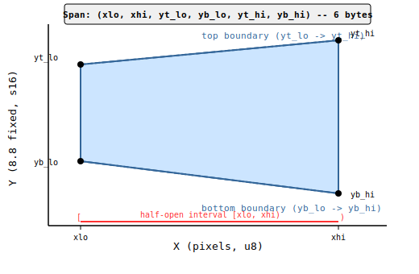
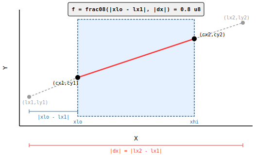
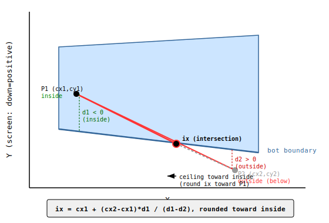
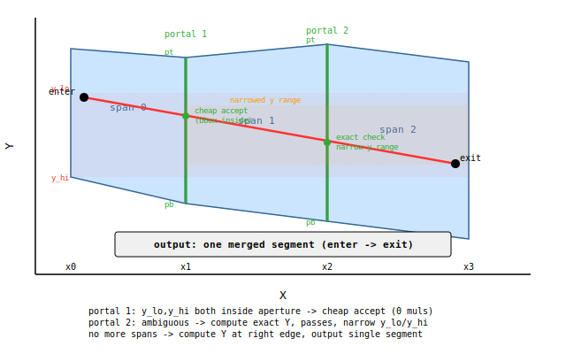

# DOOM Wireframe Clipper -- Technical Memo

## 1. Overview

The DOOM wireframe renderer clips world-space lines against a set of
**piecewise-linear visibility spans** that represent the currently-visible
portion of the screen. As the BSP traversal processes segments front-to-back,
solid walls _remove_ X ranges from the span list (via `mark_solid`) and portal
segments _tighten_ the top/bottom boundaries (via `tighten`). Each line to be
drawn is clipped analytically against the surviving spans, producing zero or
more visible sub-lines that are sent to the line rasteriser.

The entire clip pipeline is designed to execute on a 6502 using only 8x8-bit
multiply primitives (implemented as quarter-square table lookups), with one
amortised wide-math pre-clip step per line.

### 1.1 The Flat Span Representation

Each span is a 6-tuple:

```
(xlo, xhi, yt_lo, yb_lo, yt_hi, yb_hi)
```

| Field  | Type | Meaning                                  |
|--------|------|------------------------------------------|
| xlo    | u8   | Left X of the half-open interval [xlo, xhi) |
| xhi    | u8   | Right X (exclusive)                      |
| yt_lo  | s16  | Top boundary Y at xlo, 8.8 fixed point  |
| yb_lo  | s16  | Bottom boundary Y at xlo, 8.8 fixed point |
| yt_hi  | s16  | Top boundary Y at xhi, 8.8 fixed point  |
| yb_hi  | s16  | Bottom boundary Y at xhi, 8.8 fixed point |

The Y values are in **8.8 fixed point**: 256 units = 1 pixel. The integer part
is a signed pixel coordinate; the fractional part has 1/256 pixel resolution.



### 1.2 Why This Representation

Earlier designs stored span boundaries as slopes (dy/dx per column) and
accumulated them column-by-column. That approach suffered from two problems:

1. **Slope quantisation drift.** When a boundary slope is rounded to fit a
   fixed-point format, the error accumulates over the span width. Over a
   100-column span, a 1-LSB slope error produces a 100-LSB Y error.

2. **Crossover division rounding.** The `tighten` operation needs to detect
   where a new boundary crosses an old one. With slope-based storage this
   requires dividing the difference of two nearly-equal slopes, amplifying
   rounding errors.

The endpoint representation stores the exact (within 8.8) Y values at the two
X endpoints. Interpolation within the span uses `_interp`, which is a single
integer lerp with floor division. The worst-case error is 1/256 pixel at any
interior point -- it does not accumulate across the span.

The `tighten` min/max ratchet (which takes the more-restrictive of old vs new
at each endpoint) can only ever move a boundary by an integer number of 8.8
units. Because the storage is 8.8, there is no further quantisation loss from
the ratchet itself.

---

## 2. Span Operations

### 2.1 mark_solid

**Purpose:** Remove an X range `[lo, hi]` from the visibility set. Called when
a solid (non-portal) wall seg is processed.

**Algorithm:**

1. Clamp the input range to `[0, FP_RENDER_W)` giving `[ilo, ihi)`.
2. For each existing span `s`:
   - If `s` is entirely outside `[ilo, ihi)`: keep unchanged.
   - If `s` overlaps, split into up to two sub-spans:
     - Left remnant: `[s.xlo, ilo)` if `s.xlo < ilo`.
     - Right remnant: `[ihi, s.xhi)` if `ihi < s.xhi`.
   - The overlapping portion is discarded.

**Sub-span creation (`_make_sub`):** Extracts `[new_xlo, new_xhi)` from an
existing span by interpolating the four Y boundaries at the new X endpoints:

```python
def _make_sub(s, new_xlo, new_xhi):
    xlo, xhi, tl, bl, tr, br = s
    return (new_xlo, new_xhi,
            _interp(new_xlo, xlo, tl, xhi, tr),   # yt at new_xlo
            _interp(new_xlo, xlo, bl, xhi, br),   # yb at new_xlo
            _interp(new_xhi, xlo, tl, xhi, tr),   # yt at new_xhi
            _interp(new_xhi, xlo, bl, xhi, br))   # yb at new_xhi
```

The `_interp` function performs integer linear interpolation in 8.8 space:

```python
def _interp(x, x0, y0, x1, y1):
    if x1 == x0: return y0
    return y0 + (y1 - y0) * (x - x0) // (x1 - x0)
```

This is floor division, so the maximum interpolation error is +0 to +(1/256)
pixel downward (toward higher Y). The error is bounded and non-cumulative.

### 2.2 tighten

**Purpose:** Narrow the top and/or bottom boundaries of spans in an X range
`[lo, hi]` based on a portal seg's ceiling/floor lines. This is how the
renderer progressively restricts visibility through portal chains.

**Inputs:** X range `[lo, hi]`, the portal seg's screen-space X range
`[sx1, sx2]`, and its boundary Y values `(yt1, yt2, yb1, yb2)` in pixel
coordinates (converted internally to 8.8).

**Algorithm:**

For each span `s` overlapping `[ilo, ihi)`:

1. Compute the overlap sub-range `[ox0, ox1)`.

2. **Old-dominates check.** Evaluate both old and new boundaries at `ox0` and
   `ox1`. If the new top is everywhere <= the old top AND the new bottom is
   everywhere >= the old bottom, the new boundary is _less restrictive_ than
   what is already stored. Skip this span (no-op).

3. Split the span at the tighten boundaries (`ilo`, `ihi`) to isolate the
   left remnant, the overlap region, and the right remnant.

4. **Crossover detection.** Within the overlap region, the old and new
   boundaries may cross. For each of top and bottom:
   - Compute `dt0 = old - new` at `ox0` and `dt1 = old - new` at `ox1`.
   - If the signs differ, the boundaries cross inside the span.
   - The crossover X is: `cx = ox0 + dt0 * (ox1 - ox0) // (dt0 - dt1)`.
   - Split the overlap region at `cx`.

5. For each sub-interval after splitting, take the **more restrictive**
   boundary at each endpoint:
   - `result_top = max(old_top, new_top)` (higher Y = lower on screen = more restrictive ceiling)
   - `result_bot = min(old_bot, new_bot)` (lower Y = higher on screen = more restrictive floor)

6. Emit the sub-interval only if `result_top < result_bot` at either endpoint
   (i.e., the opening has not fully closed).

The crossover split ensures that within each output sub-span, one boundary
source dominates consistently. Without the split, taking max/min at the
endpoints only would produce a span where the interpolated interior might be
wrong (the old boundary might dominate on the left but the new on the right).

---

## 3. CB Clip Helper (`_clip_to_span`)

This function clips a line to a single span using Cohen-Sutherland-style
boundary (CB) clipping. It is **not** the primary clip path -- it is a helper
called by the portal walk (Section 4) in two situations:

1. **Entry clip:** When the walk cannot trivially accept entry into a span
   (the line's Y bbox is ambiguous against the span boundaries), CB clip
   finds the exact entry point.

2. **Exit clip on portal failure:** When a portal check fails (or no
   contiguous span follows), CB clip determines the exit point within the
   current span so the segment can be output.

The function takes a line in pixel coordinates (already pre-clipped to
X `[0, 255]`) and a span, and returns a clipped line or `None`.

The clipping proceeds in three stages: X clip, top boundary clip, bottom
boundary clip.



### 3.1 Pre-clip (`preclip_line_x`)

**Why needed:** The per-span arithmetic uses `frac08` to compute parametric
fractions, which requires the offset to fit in the range `[0, span]` with
`span <= 256`. If a line extends far off-screen (e.g., `lx1 = -500`), the
offset `|x - lx1|` would overflow the u8 range.

Pre-clipping restricts both X endpoints to `[0, 255]`, guaranteeing that all
subsequent `dx` values are u8 (at most 255).

**Wide math:** This is the only place wider-than-8x8 arithmetic is used. The Y
at a clip boundary is computed as:

```python
y_at = ly1 + div_round(dy * (x - lx1), dx)
```

where `dy * (x - lx1)` can be up to ~16 bits x ~16 bits. On the 6502 this
would be a 16x16 restoring division, but it only executes once per line (not
once per span), so the cost is amortised.

**Stability:** The Y is always computed from the _original_ line parameters
`(lx1, ly1, dx, dy)`, never from previously-clipped coordinates. This avoids
cascading rounding errors.

### 3.2 X Clipping

After pre-clip, the line has `dx` in the range `[-255, 255]`. The span has X
range `[xlo, xhi)` with `ex = xhi - xlo` in `[1, 256]`.

The X clip narrows the line to the span's X range:

1. If `dx > 0` and the left endpoint `cx1 < xlo`: compute Y at `xlo`.
2. If `dx > 0` and the right endpoint `cx2 > xhi - 1`: compute Y at `xhi - 1`.
3. (Symmetric for `dx < 0`.)

**The `frac08` parametric fraction:**

```python
f = frac08(|x_clip - lx1|, |dx|)
```

This computes the parametric position along the line as a **0.8 fixed-point
fraction** (u8, range 0-255 representing 0.0 to ~1.0):

```python
def frac08(offset, span):
    if span == 256: return min(offset, 255)
    return min((offset * 256 + span // 2) // span, 255)
```

The `+ span // 2` provides round-to-nearest. On the 6502, when `span < 256`,
this uses a 256-entry reciprocal table: `result = (offset * recip[span]) >> 8`
with appropriate rounding.

**The `line_y_narrow` Y computation:**

Given the parametric fraction `f`, the clipped Y is:

```python
def line_y_narrow(ly1, dy, f):
    dy_hi = dy >> 8       # high byte of dy
    dy_lo = dy & 0xFF     # low byte of dy
    hi_part = smul8(dy_hi, f)    # s8 x u8 -> s16
    lo_part = (umul8(dy_lo, f) + 128) >> 8  # u8 x u8 -> u16, take high byte
    return ly1 + hi_part + lo_part
```

This splits the wide `dy * f` into two 8x8 multiplies:
- `hi_part = dy_hi * f` contributes whole pixels.
- `lo_part = (dy_lo * f + 128) >> 8` contributes the sub-pixel portion, rounded
  to nearest by the `+ 128`.

The total cost is **2 quarter-square lookups** per Y evaluation.

### 3.3 Top/Bottom Boundary Clipping

After X clipping, we evaluate the span boundaries at the two clipped X
endpoints and check whether each line endpoint is inside or outside.



#### 3.3.1 Boundary evaluation (`eval_boundary_88`)

```python
def eval_boundary_88(y0, y1, f):
    dt = y1 - y0              # s16 difference in 8.8
    dt_hi = dt >> 8           # s8-ish (clamped, |dt_hi| <= 160)
    dt_lo = dt & 0xFF         # u8
    hi_part = smul8(dt_hi, f)            # s8 x u8 -> s16
    lo_part = (umul8(dt_lo, f) + 128) >> 8  # u8 x u8 -> u16, high byte
    return y0 + hi_part + lo_part
```

Same split-byte multiply pattern as `line_y_narrow`, but operating on 8.8
boundary values. Cost: **2 quarter-square lookups** per boundary evaluation.

There are 4 boundary evaluations per span (top and bottom at each endpoint), so
**8 multiplies** per span for boundary evaluation.

#### 3.3.2 Comparison (`compare_y_vs_boundary`)

```python
def compare_y_vs_boundary(cy_pixel, boundary_88):
    boundary_pixel = boundary_88 >> 8
    boundary_frac = boundary_88 & 0xFF
    if cy_pixel < boundary_pixel: return -1   # above
    if cy_pixel > boundary_pixel: return +1   # below
    if boundary_frac > 0:        return -1   # at pixel, boundary past it
    return 0                                  # exactly equal
```

This compares a pixel-resolution line Y against an 8.8-resolution boundary.
The fractional part matters at the boundary: if the boundary is at pixel 110
with fraction 0.62 (=159/256), then a line point at pixel 110 is _above_ the
boundary (the boundary is 0.62 sub-pixels further down).

On 6502: compare high bytes, then optionally check low byte for non-zero. Two
byte comparisons, no multiply.

#### 3.3.3 Intersection X (`boundary_ix`)

When one endpoint is inside and the other outside, we must find the X where the
line crosses the boundary.

**Inputs:**
- `cx1, cx2`: the two X endpoints (u8).
- `d1, d2`: signed distances from the line to the boundary at each endpoint.
  `d1 = _y(cy1) - boundary_at_cx1` (positive = below boundary, negative = above).
- `clip_p1`: `True` if endpoint 1 (cx1) is the outside point being clipped.

**Formula:**

```
ix = cx1 + (cx2 - cx1) * d1 / (d1 - d2)
```

This is the standard line-boundary intersection via similar triangles.

**Directed rounding (ceiling toward inside):**

The intersection X is rounded toward the _inside_ endpoint (the one that
survives clipping). This ensures no pixel outside the span boundary is drawn.

```python
if clip_p1:
    round_up = cx1 < cx2   # P1 outside, round toward P2
else:
    round_up = cx2 < cx1   # P2 outside, round toward P1

if round_up:
    ix = cx1 + -((-num) // denom)   # ceiling division
else:
    ix = cx1 + num // denom          # floor division
```

**Why the caller passes `clip_p1`:** The function cannot determine which
endpoint is outside from the sign of `d1` alone, because the "outside"
direction depends on whether we are clipping against the top boundary (outside
= above, `d < 0`) or bottom boundary (outside = below, `d > 0`). The caller
knows which boundary is being clipped and passes the appropriate flag.

On 6502, this is a 16-bit division (the `d` values are up to 16 bits), but it
only executes when a boundary clip actually occurs (0-2 times per span).

### 3.4 Worked Example

**Line:** (131, 114) to (134, 101)
**Span:** `[87, 256)` with `yt_lo=0, yb_lo=28013, yt_hi=0, yb_hi=29184`

This span has a flat top boundary at Y=0 and a bottom boundary that slopes from
roughly pixel 109.4 on the left to pixel 114.0 on the right.

#### Step 0: Setup

```
dx = 134 - 131 = 3
dy = 101 - 114 = -13
ex = 256 - 87  = 169
```

#### Step 1: Pre-clip

Both endpoints have X in `[0, 255]`. No pre-clip adjustment needed.

#### Step 2: X clip to [87, 255]

- `dx > 0`, `cx1 = 131 >= xlo = 87`: no left clip.
- `dx > 0`, `cx2 = 134 <= xhi - 1 = 255`: no right clip.

After X clip: `(cx1, cy1) = (131, 114)`, `(cx2, cy2) = (134, 101)`.

#### Step 3: Boundary evaluation

**Parametric fractions at clipped endpoints:**

```
f1 = frac08(|131 - 87|, 169) = frac08(44, 169)
   = (44 * 256 + 84) // 169
   = (11264 + 84) // 169
   = 11348 // 169
   = 67

f2 = frac08(|134 - 87|, 169) = frac08(47, 169)
   = (47 * 256 + 84) // 169
   = (12032 + 84) // 169
   = 12116 // 169
   = 71
```

**Top boundary at endpoints:**

```
top1 = eval_boundary_88(0, 0, 67)
     dt = 0, dt_hi = 0, dt_lo = 0
     = 0 + 0 + 0 = 0

top2 = eval_boundary_88(0, 0, 71) = 0
```

**Bottom boundary at endpoints:**

```
bot1 = eval_boundary_88(28013, 29184, 67)
     dt = 29184 - 28013 = 1171
     dt_hi = 1171 >> 8 = 4          (0x04)
     dt_lo = 1171 & 0xFF = 147      (0x93)
     hi_part = umul8(4, 67) = 268
     lo_part = (umul8(147, 67) + 128) >> 8
             = (9849 + 128) >> 8
             = 9977 >> 8
             = 38
     bot1 = 28013 + 268 + 38 = 28319

     (pixel: 28319 >> 8 = 110, frac: 28319 & 255 = 159)

bot2 = eval_boundary_88(28013, 29184, 71)
     hi_part = umul8(4, 71) = 284
     lo_part = (umul8(147, 71) + 128) >> 8
             = (10437 + 128) >> 8
             = 10565 >> 8
             = 41
     bot2 = 28013 + 284 + 41 = 28338

     (pixel: 28338 >> 8 = 110, frac: 28338 & 255 = 178)
```

#### Step 4: Top boundary clip

```
compare_y_vs_boundary(114, 0):  114 > 0 (pixel)  -> +1 (below)
compare_y_vs_boundary(101, 0):  101 > 0 (pixel)  -> +1 (below)
```

Both endpoints are below the top boundary. No top clip needed.

#### Step 5: Bottom boundary clip

```
compare_y_vs_boundary(114, 28319):
    boundary_pixel = 110, boundary_frac = 159
    114 > 110  ->  +1 (below)
    below1 = True  (endpoint 1 is OUTSIDE, below the bottom boundary)

compare_y_vs_boundary(101, 28338):
    boundary_pixel = 110, boundary_frac = 178
    101 < 110  ->  -1 (above)
    below2 = False (endpoint 2 is INSIDE)
```

Endpoint 1 is below the bottom boundary; endpoint 2 is inside. We need to clip
endpoint 1.

**Distance computation (in 8.8 space):**

```
d1 = _y(114) - bot1 = 29184 - 28319 = 865    (positive: below boundary)
d2 = _y(101) - bot2 = 25856 - 28338 = -2482  (negative: above boundary)
```

**Intersection X:**

```
boundary_ix(131, 134, 865, -2482, clip_p1=True)
    denom = 865 - (-2482) = 3347
    num   = (134 - 131) * 865 = 3 * 865 = 2595
    clip_p1=True, cx1=131 < cx2=134  ->  round_up = True (round toward P2)
    ix = 131 + -((-2595) // 3347)
       = 131 + -((-2595) // 3347)
       = 131 + -(-1)
       = 131 + 1
       = 132
```

**Y at intersection (from original line parameters):**

```
f = frac08(|132 - 131|, |3|) = frac08(1, 3)
  = (1 * 256 + 1) // 3
  = 257 // 3
  = 85

iy = line_y_narrow(114, -13, 85)
    dy_hi = -13 >> 8 = -1       (Python floor: -13/256 rounds down to -1)
    dy_lo = -13 & 0xFF = 243    (-1*256 + 243 = -13 check)
    abs_dy_hi = 1
    hi_part = -(umul8(1, 85)) = -85
    lo_part = (umul8(243, 85) + 128) >> 8
            = (20655 + 128) >> 8
            = 20783 >> 8
            = 81
    iy = 114 + (-85) + 81 = 110
```

**Result:** Replace endpoint 1 with `(132, 110)`.

#### Step 6: Final validation

```
dx >= 0, cx1=132 <= cx2=134: OK
Clamp: cy1=110 in [0,159], cy2=101 in [0,159]: no change
```

**Output line: (132, 110) -> (134, 101)**

The line has been clipped from below by the bottom boundary. The original
endpoint at (131, 114) was below the boundary at that column (boundary pixel
110.62, line pixel 114), so it was moved inward to (132, 110), where the line
meets the boundary.

**Multiply budget for this example:**
- Boundary evaluation: 4 calls to `eval_boundary_88` x 2 multiplies = **8 multiplies** (8x8)
- `frac08`: 4 calls (f1, f2, intersection f, intersection frac) -- division, no multiply
- `line_y_narrow`: 1 call x 2 multiplies = **2 multiplies** (8x8)
- `boundary_ix`: 1 call -- division only, no multiply
- **Total: 10 multiplies** (all 8x8), **2 divisions** (one wide for `boundary_ix`)

---

## 4. Portal Walk (`draw_clipped`)

The portal walk is the **primary clipping mechanism**. It iterates spans
left-to-right, entering and exiting spans through portal apertures at shared
boundaries. A single isolated span is simply a degenerate portal walk: one
span, no portals. There is no separate "single-span clip" path.

The `draw_clipped` method processes each line through the following stages:

### 4.1 Global Bounding Box Reject

Before any per-span work, the line's axis-aligned bounding box is tested
against the global span bounding box (4 bytes of ZP: `x_min`, `x_max`,
`yt_min`, `yb_max`):

```python
if x_hi < bx0 or x_lo >= bx1 or y_hi < bt or y_lo > bb:
    continue   # line is entirely outside all spans
```

This is 4 comparisons, zero multiplies. It rejects lines that are completely
off-screen or outside the remaining visibility region.

### 4.2 Pre-clip

```python
pc = preclip_line_x(lx1, ly1, lx2, ly2)
```

One wide-math division per clipped endpoint. After pre-clip, the line is
oriented left-to-right: `(xl, yl, xr, yr)` with `dx_line = xr - xl >= 0`.
The line's Y bounding box is computed: `y_lo = min(yl, yr)`,
`y_hi = max(yl, yr)`.

### 4.3 Forward Walk

The walk iterates through spans left-to-right, maintaining a current segment
state (`seg_start`). At any point, the walk is either building a segment
(inside a span chain) or looking for a new span to enter.



For each span `s` that overlaps the line's X range:

#### 4.3.1 Entry (no segment in progress)

When `seg_start` is `None`, the walk tries to **enter** this span using a
three-tier test:

1. **Outer bbox reject (0 muls).** Compute the span's outer bounding box in
   pixel space: `ot = min(top_pixels)`, `ob = max(bot_pixels)`. If
   `y_hi < ot` or `y_lo > ob`, the line cannot possibly intersect this span.
   Skip to the next span.

2. **Inner bbox accept (0 muls).** Compute the span's inner bounding box:
   `it = max(top_pixels)`, `ib = min(bot_pixels)`. If `y_lo >= it` and
   `y_hi <= ib`, the line is guaranteed to be inside the span at every
   column. Enter at the left edge of the overlap:
   `seg_start = (max(xl, xlo), y_at_entry)`.

3. **Ambiguous -- full CB clip.** Call `_clip_to_span` (Section 3) to find
   the exact entry point. If it returns `None`, the line misses this span;
   skip to the next. Otherwise, `seg_start = (clip_x1, clip_y1)`.

#### 4.3.2 Continuation (segment in progress)

When `seg_start` is set and the walk enters a new span, the segment simply
continues. The portal check at the previous span's boundary already confirmed
that the line passes into this span, so no additional entry test is needed.

#### 4.3.3 Exit: Portal Check to Next Span

After entering or continuing through a span, the walk checks whether the line
can exit through a **portal** into the next contiguous span. Two spans are
contiguous if the current span's `xhi` equals the next span's `xlo`.

If a next contiguous span exists, the portal aperture at the shared boundary
`px = s.xhi` is:

```python
pt = _px(max(s.yt_hi, next_s.yt_lo))   # tightest top at portal
pb = _px(min(s.yb_hi, next_s.yb_lo))   # tightest bottom at portal
```

The portal is open if `pt < pb`. The line is tested against it with a
**three-tier check**:

1. **Cheap bbox accept (0 muls).** If `pt <= y_lo` and `y_hi <= pb`, the
   line's entire Y range fits within the portal aperture. The line passes
   through without computing `line_y_at(px)`. Continue to the next span.

2. **Cheap bbox reject (0 muls).** If `y_hi < pt` or `y_lo > pb`, the
   line's entire Y range is outside the portal. The portal is missed.

3. **Exact check (2 muls).** Compute `ly = line_y_at(px)`. If
   `pt <= ly <= pb`, the line passes through. **Narrow the Y bbox** for
   future portal checks: `y_lo = min(y_lo, ly)`, `y_hi = max(y_hi, ly)`.
   This tightening makes subsequent cheap accepts more likely. Continue to
   the next span.

If the portal is closed (`pt >= pb`) or the line fails the check:

- Call `_clip_to_span` on the current span to find the exit point.
- Output the segment from `seg_start` to the clip exit.
- Reset `seg_start = None` (the walk will try to re-enter a later span).


#### 4.3.4 Exit: No Next Contiguous Span

If there is no next contiguous span (either the next span has a gap, or this
is the last span), compute Y at the right edge of the overlap and output the
segment:

```python
xx = min(xr, s.xhi - 1)
ey = line_y_at(xx)
output segment: seg_start -> (xx, ey)
seg_start = None
```

### 4.4 Walk Properties

**Single span, no portals:** When a line only overlaps one span, the walk
enters it (via the three-tier entry test), finds no next contiguous span, and
outputs the segment immediately. This is the degenerate case -- there is no
separate code path.

**Merged output across contiguous spans:** When all portal checks pass, the
walk produces a single continuous segment from the entry point in the first
span to the exit point in the last span. This avoids visible gaps or overlaps
at span boundaries that would result from clipping each span independently.

**Fragmented output on portal failure:** When a portal check fails, the walk
outputs the segment up to the CB clip exit, resets, and tries to re-enter
subsequent spans. This can produce multiple short line segments (see the
diagram above). Each fragment is independently correct.

**Contiguity is implicit:** The walk checks `spans[si+1].xlo == s.xhi` on
the fly. There is no separate grouping step -- spans that are not contiguous
simply cause the walk to output and reset.

---

## 5. Precision Analysis

### 5.1 Format Table

| Value | Format | Type | Range | Bit Width | Multiply |
|-------|--------|------|-------|-----------|----------|
| Screen X (pixel) | 8.0 | u8 | [0, 255] | 8 | -- |
| Screen Y (pixel) | 8.0 | s9 | [-256, 255] | 9 | -- |
| Span xlo, xhi | 8.0 | u8 | [0, 256] | 9* | -- |
| Span yt/yb (8.8) | 8.8 | s16 | [-2560, 43520] | 16 | -- |
| dx (post-preclip) | 8.0 | u8 | [0, 255] | 8 | -- |
| dy (post-preclip) | 8.0 | s14 | [-16383, 16383] | 14 | -- |
| ex (span width) | 8.0 | u9 | [1, 256] | 9 | -- |
| frac08 (f) | 0.8 | u8 | [0, 255] | 8 | div only |
| dt_hi (boundary delta high) | 8.0 | s8 | [-160, 160] | 8 | 8x8 |
| dt_lo (boundary delta low) | 0.8 | u8 | [0, 255] | 8 | 8x8 |
| dy_hi (line delta high) | 8.0 | s8 | [-128, 127] | 8 | 8x8 |
| dy_lo (line delta low) | 0.8 | u8 | [0, 255] | 8 | 8x8 |
| hi_part (boundary) | 8.8 | s16 | [-32768, 32767] | 16 | result of 8x8 |
| lo_part (boundary) | 8.0 | u8 | [0, 255] | 8 | result of 8x8 >> 8 |
| eval_boundary result | 8.8 | s16 | [-2560, 43520] | 16 | -- |
| line_y_narrow result | 8.0 | s16 | [-256, 416] | 10 | -- |
| d1, d2 (distances) | 8.8 | s16 | [-43520, 43520] | 16 | -- |
| boundary_ix denom | -- | s17 | -- | 17 | wide div |
| boundary_ix num | -- | s25 | -- | 25 | wide mul |
| preclip numerator | -- | s28 | -- | 28 | wide mul+div |

(*) `xhi` can be 256 (for a span spanning the full screen width).

### 5.2 Multiply Budget

**Per-span operations (all 8x8):**

| Operation | Count | Multiplies | Type |
|-----------|-------|------------|------|
| frac08 (at cx1, cx2 within span) | 2 | 0 | division only |
| eval_boundary_88 (top at cx1, cx2) | 2 | 4 | 8x8 |
| eval_boundary_88 (bot at cx1, cx2) | 2 | 4 | 8x8 |
| line_y_narrow (X clip endpoints) | 0-2 | 0-4 | 8x8 |
| line_y_narrow (boundary intersection) | 0-2 | 0-4 | 8x8 |
| **Typical total per span** | | **8-16** | **8x8** |

On a 6502 with quarter-square multiply, each 8x8 unsigned multiply takes
approximately 28-36 cycles (table lookup, subtract, indexing). Signed multiply
adds a negate-if-negative wrapper: approximately 40-50 cycles. So 8-16
multiplies costs roughly 300-650 cycles per span.

**Per-line operations (wide math):**

| Operation | Count | Type | Cost |
|-----------|-------|------|------|
| preclip Y at X=0 or X=255 | 0-2 | 16x16 div | ~200-400 cycles each |
| boundary_ix | 0-2 | 16-bit div | ~200-300 cycles each |

The per-line wide division is amortised across all spans the line touches.
For a typical line crossing 2-3 spans, the amortised cost per span is
approximately 100-200 cycles.

**Portal walk savings:** When the walk passes through portals via cheap bbox
accept (tier 1), it skips the full CB clip for intermediate spans entirely.
For a line crossing 3 contiguous spans where all portals cheaply accept, the
walk performs only 2 CB clips (entry into the first span, exit from the last)
instead of 3, and the portal checks cost 0 multiplies each. The exact portal
check (tier 3) costs only 2 multiplies (one `line_y_narrow` call), compared
to 8-16 multiplies for a full CB clip.

**Total estimated per-span cost:** ~500-900 cycles for the clipping math,
excluding span traversal overhead.

### 5.3 Rounding Analysis

There are five distinct points where rounding occurs in the pipeline:

#### 5.3.1 `_interp` floor-division residual

```python
y0 + (y1 - y0) * (x - x0) // (x1 - x0)
```

Python's `//` floors toward negative infinity. The maximum error is 1 LSB of
the 8.8 format, which is **1/256 pixel**. This is sub-pixel and not visually
detectable.

This affects: `_make_sub`, `tighten` boundary evaluation, crossover detection.

#### 5.3.2 `line_y_narrow` round-to-nearest

```python
lo_part = (umul8(dy_lo, f) + 128) >> 8
```

The `+ 128` before the right-shift provides **round-to-nearest** for the low
byte product. Maximum error: **0.5 LSB** of the pixel-level result, i.e.,
0.5 pixels. This is the dominant source of visible rounding in the clipper.

However, the line rasteriser itself has pixel-level granularity, so a 0.5-pixel
error in the clip point is at most 1 pixel of visible deviation.

#### 5.3.3 `eval_boundary_88` round-to-nearest

Same pattern as `line_y_narrow`:

```python
lo_part = (umul8(dt_lo, f) + 128) >> 8
```

Maximum error: **0.5 LSB** of the 8.8 result = **1/512 pixel**. This is
sub-pixel and visually negligible.

#### 5.3.4 `boundary_ix` ceiling-toward-inside

```python
ix = cx1 + -((-num) // denom)   # when rounding toward higher X
ix = cx1 + num // denom          # when rounding toward lower X
```

The direction is chosen to round the intersection X **toward the inside
endpoint** (the one that survives). This is a conservative choice: it may
reject one extra pixel at the boundary, but it never draws a pixel that is
genuinely outside the span. Maximum deviation: **1 pixel** in X.

#### 5.3.5 `frac08` round-to-nearest

```python
r = (offset * 256 + span // 2) // span
```

The `+ span // 2` provides round-to-nearest. Maximum error: **0.5 LSB** of the
0.8 result = **1/512** of the span width. For a 100-column span, this is less
than 0.2 pixels.

#### 5.3.6 `tighten` min/max ratchet

The ratchet takes `max(old_top, new_top)` and `min(old_bot, new_bot)` at each
endpoint. Because both values are stored in 8.8 with the same quantisation
grid, the ratchet itself introduces **no additional error**. The only error is
what was already present from the `_interp` evaluations (1/256 pixel each).

Over multiple tighten passes, the boundaries can only move inward (more
restrictive). The error does not accumulate across passes because each pass
stores exact 8.8 values at the endpoints -- it is the _interpolated interior_
that has the 1/256 error, and that error is recomputed fresh each time.

---

## 6. Pseudocode

### 6.1 Forward Walk (`draw_clipped`, per-line)

Complete pseudocode for the portal walk with register-width annotations,
suitable for 6502 porting.

```
function draw_clipped_line(
    lx1: s16,    // raw line endpoint 1 X
    ly1: s16,    // raw line endpoint 1 Y
    lx2: s16,    // raw line endpoint 2 X
    ly2: s16,    // raw line endpoint 2 Y
    spans: Span[],
    bbox: (bx0:u8, bx1:u8, bt:u8, bb:u8)
)
    // ================================================================
    // STAGE 0: GLOBAL BBOX REJECT (4 comparisons, 0 muls)
    // ================================================================

    x_lo: u8 = min(lx1, lx2)
    x_hi: u8 = max(lx1, lx2)
    y_lo: s16 = min(ly1, ly2)
    y_hi: s16 = max(ly1, ly2)

    if x_hi < bx0 or x_lo >= bx1: return       // X reject
    if y_hi < bt or y_lo > bb: return            // Y reject

    // ================================================================
    // STAGE 1: PRE-CLIP LINE X TO [0, 255] (wide math, per-line)
    // ================================================================

    (lx1, ly1, lx2, ly2) = PRECLIP_LINE_X(lx1, ly1, lx2, ly2)
    if result is NULL: return

    // Orient left-to-right
    if lx1 <= lx2:
        xl = lx1; yl = ly1; xr = lx2; yr = ly2
    else:
        xl = lx2; yl = ly2; xr = lx1; yr = ly1

    dx_line: u8 = xr - xl
    dy_line: s16 = yr - yl
    y_lo: s16 = min(yl, yr)
    y_hi: s16 = max(yl, yr)

    // Helper: compute line Y at any X via split-byte multiply
    function LINE_Y_AT(x: u8) -> s16:
        if dx_line == 0: return yl
        f: u8 = FRAC08(x - xl, dx_line)
        return LINE_Y_NARROW(yl, dy_line, f)      // 2 x 8x8 multiply

    // ================================================================
    // STAGE 2: FORWARD WALK
    // ================================================================

    seg_start: (u8, s16) or NULL = NULL    // (sx, sy) of current segment

    for si = 0 to len(spans) - 1:
        s = spans[si]
        if s.xhi <= xl: continue           // span entirely left of line
        if s.xlo >= xr: continue           // span entirely right of line

        // ---- Compute span outer bbox (pixel space) ----
        ot: s16 = min(_PX(s.yt_lo), _PX(s.yt_hi))   // outer top
        ob: s16 = max(_PX(s.yb_lo), _PX(s.yb_hi))   // outer bottom

        // ============================================================
        // ENTRY: try to enter this span (only if seg_start is NULL)
        // ============================================================

        if seg_start is NULL:
            // Tier 1: outer bbox reject (0 muls)
            if y_hi < ot or y_lo > ob:
                continue

            // Tier 2: inner bbox accept (0 muls)
            it: s16 = max(_PX(s.yt_lo), _PX(s.yt_hi))   // inner top
            ib: s16 = min(_PX(s.yb_lo), _PX(s.yb_hi))   // inner bottom
            if y_lo >= it and y_hi <= ib:
                ex: u8 = max(xl, s.xlo)
                seg_start = (ex, LINE_Y_AT(ex) if ex != xl else yl)
            else:
                // Tier 3: CB clip for exact entry (8-16 muls)
                c = CLIP_TO_SPAN(lx1, ly1, lx2, ly2, s)
                if c is NULL:
                    continue
                seg_start = (c.x1, c.y1)

        // (else: segment already in progress from portal pass)

        // ============================================================
        // EXIT: check portal to next contiguous span
        // ============================================================

        next_s: Span or NULL = NULL
        if si + 1 < len(spans):
            ns = spans[si + 1]
            if ns.xlo == s.xhi and ns.xlo < xr:
                next_s = ns

        if next_s is not NULL:
            // Portal at shared boundary X
            px: u8 = s.xhi
            pt: s16 = _PX(max(s.yt_hi, next_s.yt_lo))   // tightest top
            pb: s16 = _PX(min(s.yb_hi, next_s.yb_lo))   // tightest bot

            if pt < pb:       // portal is open
                // Tier 1: cheap bbox accept (0 muls)
                if pt <= y_lo and y_hi <= pb:
                    continue  // pass through, keep seg_start

                // Tier 2: cheap bbox reject (0 muls)
                if y_hi < pt or y_lo > pb:
                    // fall through to portal-fail below

                else:
                    // Tier 3: exact check (2 muls)
                    ly: s16 = LINE_Y_AT(px)
                    if pt <= ly and ly <= pb:
                        // Narrow y bbox for future portals
                        y_lo = min(y_lo, ly)
                        y_hi = max(y_hi, ly)
                        continue  // pass through

            // ---- Portal failed or closed ----
            c = CLIP_TO_SPAN(lx1, ly1, lx2, ly2, s)
            if c is not NULL:
                OUTPUT_SEGMENT(seg_start, (c.x2, c.y2))
            seg_start = NULL

        else:
            // ---- No next contiguous span: output at right edge ----
            xx: u8 = min(xr, s.xhi - 1)
            ey: s16 = LINE_Y_AT(xx) if xx != xr else yr
            OUTPUT_SEGMENT(seg_start, (xx, ey))
            seg_start = NULL

end
```

### 6.2 CB Clip Helper (`_clip_to_span`)

Pseudocode for the per-span CB clip with register-width annotations.

```
function clip_to_span(
    lx1: s16,   // original line endpoint 1 X (pre-clipped to [0,255])
    ly1: s16,   // original line endpoint 1 Y
    lx2: s16,   // original line endpoint 2 X (pre-clipped to [0,255])
    ly2: s16,   // original line endpoint 2 Y
    span: Span   // (xlo:u8, xhi:u9, tl:s16, bl:s16, tr:s16, br:s16)
) -> (cx1:u8, cy1:s16, cx2:u8, cy2:s16) or NULL

    // ---- Unpack span ----
    xlo: u8  = span.xlo
    xhi: u9  = span.xhi          // can be 256
    tl:  s16 = span.yt_lo        // 8.8 top at xlo
    bl:  s16 = span.yb_lo        // 8.8 bot at xlo
    tr:  s16 = span.yt_hi        // 8.8 top at xhi
    br:  s16 = span.yb_hi        // 8.8 bot at xhi
    ex:  u9  = xhi - xlo         // span width, [1, 256]
    if ex <= 0: return NULL

    // ---- Compute line deltas ----
    dx: s9  = lx2 - lx1          // [-255, 255] after preclip
    dy: s16 = ly2 - ly1          // pixel delta
    abs_dx: u8 = |dx|            // [0, 255]

    // ---- Initialize clipped coords ----
    cx1: s16 = lx1
    cy1: s16 = ly1
    cx2: s16 = lx2
    cy2: s16 = ly2

    // ================================================================
    // STAGE 1: X CLIP TO [xlo, xhi-1]
    // ================================================================

    if dx == 0:
        if lx1 < xlo or lx1 >= xhi:
            return NULL
    else:
        // ---- Left boundary clip ----
        need_left: bool = (dx > 0 and cx1 < xlo) or (dx < 0 and cx2 < xlo)
        if need_left:
            offset: u8 = |xlo - lx1|             // [0, 255]
            f: u8 = FRAC08(offset, abs_dx)        // 0.8, division
            y_at: s16 = LINE_Y_NARROW(ly1, dy, f) // 8x8 multiply (x2)
            if dx > 0:
                cx1 = xlo; cy1 = y_at
            else:
                cx2 = xlo; cy2 = y_at

        // ---- Right boundary clip ----
        xhi_clip: u8 = xhi - 1                    // [0, 255]
        need_right: bool = (dx > 0 and cx2 > xhi_clip) or (dx < 0 and cx1 > xhi_clip)
        if need_right:
            offset: u8 = |xhi_clip - lx1|         // [0, 255]
            f: u8 = FRAC08(offset, abs_dx)         // 0.8, division
            y_at: s16 = LINE_Y_NARROW(ly1, dy, f)  // 8x8 multiply (x2)
            if dx > 0:
                cx2 = xhi_clip; cy2 = y_at
            else:
                cx1 = xhi_clip; cy1 = y_at

        // ---- Reject if fully outside ----
        if min(cx1, cx2) >= xhi: return NULL
        if max(cx1, cx2) < xlo: return NULL

    // ================================================================
    // STAGE 2: EVALUATE BOUNDARIES AT CLIPPED ENDPOINTS
    // ================================================================

    // Parametric fractions within span
    f1: u8 = FRAC08(|cx1 - xlo|, ex)              // division
    f2: u8 = FRAC08(|cx2 - xlo|, ex)              // division

    // Top boundary at endpoints                   // 8x8 multiply (x2 each)
    top1: s16 = EVAL_BOUNDARY_88(tl, tr, f1)
    top2: s16 = EVAL_BOUNDARY_88(tl, tr, f2)

    // Bottom boundary at endpoints                // 8x8 multiply (x2 each)
    bot1: s16 = EVAL_BOUNDARY_88(bl, br, f1)
    bot2: s16 = EVAL_BOUNDARY_88(bl, br, f2)

    // ================================================================
    // STAGE 3: TOP BOUNDARY CLIP (cy >= top)
    // ================================================================

    above1: bool = COMPARE_Y_VS_BOUNDARY(cy1, top1) < 0
    above2: bool = COMPARE_Y_VS_BOUNDARY(cy2, top2) < 0

    if above1 and above2:
        return NULL                                // entirely above

    if above1 or above2:
        // Distance from line to top boundary (in 8.8 space)
        d1: s16 = (cy1 << 8) - top1               // shift + subtract
        d2: s16 = (cy2 << 8) - top2

        // Intersection X with directed rounding
        ix: u8 = BOUNDARY_IX(cx1, cx2, d1, d2, above1)  // wide division
        if ix is NULL: return NULL

        // Y at intersection (from original line)
        if dx != 0:
            f: u8 = FRAC08(|ix - lx1|, abs_dx)            // division
            iy: s16 = LINE_Y_NARROW(ly1, dy, f)            // 8x8 multiply (x2)
        else:
            iy: s16 = ly1

        // Replace outside endpoint
        if above1:
            cx1 = ix; cy1 = iy
            // Recompute bottom boundary at new cx1
            fnew: u8 = FRAC08(|ix - xlo|, ex)              // division
            bot1 = EVAL_BOUNDARY_88(bl, br, fnew)           // 8x8 multiply (x2)
        else:
            cx2 = ix; cy2 = iy
            fnew: u8 = FRAC08(|ix - xlo|, ex)
            bot2 = EVAL_BOUNDARY_88(bl, br, fnew)           // 8x8 multiply (x2)

    // ================================================================
    // STAGE 4: BOTTOM BOUNDARY CLIP (cy <= bot)
    // ================================================================

    below1: bool = COMPARE_Y_VS_BOUNDARY(cy1, bot1) > 0
    below2: bool = COMPARE_Y_VS_BOUNDARY(cy2, bot2) > 0

    if below1 and below2:
        return NULL                                // entirely below

    if below1 or below2:
        d1: s16 = (cy1 << 8) - bot1               // shift + subtract
        d2: s16 = (cy2 << 8) - bot2

        ix: u8 = BOUNDARY_IX(cx1, cx2, d1, d2, below1)  // wide division
        if ix is NULL: return NULL

        if dx != 0:
            f: u8 = FRAC08(|ix - lx1|, abs_dx)
            iy: s16 = LINE_Y_NARROW(ly1, dy, f)            // 8x8 multiply (x2)
        else:
            iy: s16 = ly1

        if below1:
            cx1 = ix; cy1 = iy
        else:
            cx2 = ix; cy2 = iy

    // ================================================================
    // STAGE 5: FINAL VALIDATION
    // ================================================================

    if dx >= 0:
        if cx1 > cx2: return NULL
    else:
        if cx1 < cx2: return NULL

    // Clamp Y to screen
    cy1 = clamp(cy1, 0, 159)
    cy2 = clamp(cy2, 0, 159)

    return (cx1, cy1, cx2, cy2)
end
```

### 6.3 Subroutines

```
// ================================================================
// SUBROUTINES
// ================================================================

function FRAC08(offset: u8, span: u9) -> u8          // division only
    // Compute offset/span as 0.8 fixed point, round-to-nearest
    if span == 256:
        return min(offset, 255)
    return min((offset * 256 + span / 2) / span, 255)
    // On 6502: reciprocal table lookup
end


function EVAL_BOUNDARY_88(y0: s16, y1: s16, f: u8) -> s16
    // 2 x 8x8 multiply
    dt: s16 = y1 - y0
    dt_hi: s8 = dt >> 8              // arithmetic shift right 8
    dt_lo: u8 = dt & 0xFF
    abs_dt_hi: u8 = |dt_hi|
    sign: bool = (dt_hi < 0)

    hi_product: u16 = UMUL8(abs_dt_hi, f)         // 8x8 multiply
    hi_part: s16 = sign ? -hi_product : hi_product

    lo_product: u16 = UMUL8(dt_lo, f)             // 8x8 multiply
    lo_part: u8 = (lo_product + 128) >> 8          // round-to-nearest, take high byte

    return y0 + hi_part + lo_part
end


function LINE_Y_NARROW(ly1: s16, dy: s16, f: u8) -> s16
    // 2 x 8x8 multiply   (identical structure to EVAL_BOUNDARY_88)
    dy_hi: s8 = dy >> 8              // arithmetic shift right 8
    dy_lo: u8 = dy & 0xFF
    abs_dy_hi: u8 = |dy_hi|
    sign: bool = (dy_hi < 0)

    hi_product: u16 = UMUL8(abs_dy_hi, f)         // 8x8 multiply
    hi_part: s16 = sign ? -hi_product : hi_product

    lo_product: u16 = UMUL8(dy_lo, f)             // 8x8 multiply
    lo_part: u8 = (lo_product + 128) >> 8

    return ly1 + hi_part + lo_part
end


function COMPARE_Y_VS_BOUNDARY(cy_pixel: s16, boundary_88: s16) -> s8
    // No multiply -- byte comparisons only
    bpx: s8 = boundary_88 >> 8       // integer pixel part
    bfr: u8 = boundary_88 & 0xFF     // fractional part
    if cy_pixel < bpx: return -1     // above
    if cy_pixel > bpx: return +1     // below
    if bfr > 0:        return -1     // at pixel, boundary past it
    return 0
end


function BOUNDARY_IX(cx1: u8, cx2: u8, d1: s16, d2: s16, clip_p1: bool) -> u8 or NULL
    // Wide division (16-bit numerator / 16-bit denominator)
    denom: s17 = d1 - d2
    if denom == 0: return NULL

    num: s25 = (cx2 - cx1) * d1      // wide multiply

    if clip_p1:
        round_up: bool = (cx1 < cx2) // round toward P2 (the inside point)
    else:
        round_up: bool = (cx2 < cx1) // round toward P1 (the inside point)

    if round_up:
        ix = cx1 + CEIL_DIV(num, denom)
    else:
        ix = cx1 + FLOOR_DIV(num, denom)

    return ix
end


function UMUL8(a: u8, b: u8) -> u16
    // Quarter-square table lookup on 6502
    // result = QS[a+b] - QS[|a-b|]  where QS[n] = floor(n^2/4)
    return a * b
end
```

### 6.4 Register Allocation Notes for 6502

The key working values during the forward walk and their suggested storage:

| Value | Width | Storage |
|-------|-------|---------|
| seg_start (sx, sy) | u8 + s16 | Zero page (3 bytes) |
| y_lo, y_hi | s16 | Zero page (4 bytes) |
| xl, yl, xr, yr | u8 + s16 (x2) | Zero page (6 bytes) |
| dx_line, dy_line | u8 + s16 | Zero page (3 bytes) |
| span index (si) | u8 | Zero page |
| **Walk state total** | | **~17 bytes** |

Additional values during `_clip_to_span`:

| Value | Width | Storage |
|-------|-------|---------|
| cx1, cx2 | u8 | Zero page |
| cy1, cy2 | s16 | Zero page (2 bytes each) |
| dx, abs_dx | u8 | Zero page |
| dy | s16 | Zero page (2 bytes) |
| xlo, xhi | u8/u9 | Zero page |
| ex | u9 | Zero page (2 bytes) |
| tl, bl, tr, br | s16 | Zero page (8 bytes) |
| f1, f2 | u8 | A register / temp |
| top1, top2, bot1, bot2 | s16 | Zero page (8 bytes) |
| d1, d2 | s16 | Zero page (4 bytes) |
| **CB clip total** | | **~34 bytes** |

The walk state and CB clip state share the ZP region `$A0-$CF` reserved for
clipper hooks. The CB clip temporaries overlay the walk's line/span values
since `_clip_to_span` receives the original line parameters and the current
span as arguments.

### 6.5 Cycle Budget Summary

| Stage | Multiplies | Divides | Est. Cycles |
|-------|-----------|---------|-------------|
| Global bbox reject (per line) | 0 | 0 | 20-40 |
| Preclip (per line) | 0 | 0-2 wide | 0-800 |
| Portal cheap accept (per portal) | 0 | 0 | 20-30 |
| Portal exact check (per portal) | 2 (8x8) | 1 frac08 | 100-150 |
| CB clip entry (per entry) | 8-16 (8x8) | 2-7 frac08 + 0-2 wide | 700-1500 |
| CB clip exit on portal fail | 8-16 (8x8) | 2-7 frac08 + 0-2 wide | 700-1500 |
| Right-edge exit (per segment end) | 0-2 (8x8) | 0-1 frac08 | 0-150 |

For a typical line crossing 3 contiguous spans with 2 cheap-accept portals:
1 CB clip entry + 2 portal checks (0 muls each) + 1 right-edge exit =
roughly 800-1700 cycles total, compared to 3 independent CB clips at
2100-4500 cycles. The portal walk saves 40-60% of multiply work in the
common case.

For a typical frame with ~50 visible lines averaging 2 spans each, the
clipper's total cost is approximately 70,000-150,000 cycles, well within the
budget of a 2 MHz 6502 rendering at low frame rates.
