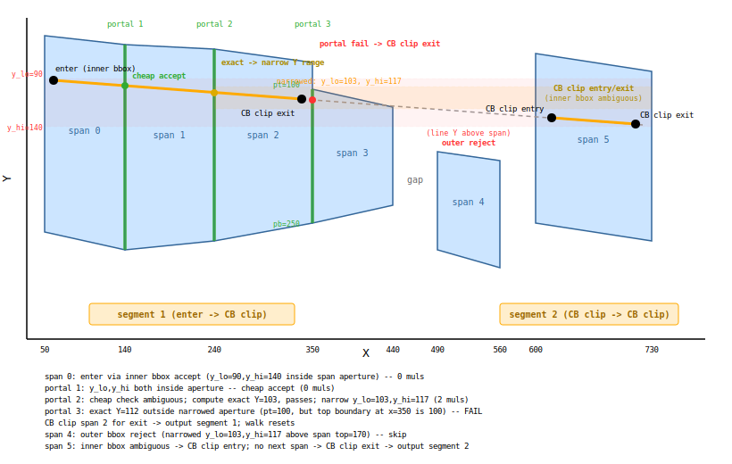

# DOOM Wireframe Clipper -- Technical Memo

## 1. Overview

The DOOM wireframe renderer clips world-space lines against a set of
**piecewise-linear visibility spans** that represent the currently-visible
portion of the screen. As the BSP traversal processes segments front-to-back,
solid walls _remove_ X ranges from the span list (via `mark_solid`) and portal
segments _tighten_ the top/bottom boundaries (via `tighten`). Each line to be
drawn is clipped analytically against the surviving spans, producing zero or
more visible sub-lines that are sent to the line rasteriser.

The entire clip pipeline is designed to execute on a 6502 using only 8x8-bit
multiply primitives (implemented as quarter-square table lookups), with
adaptive-width real division for line Y computation.

### 1.1 The Flat Span Representation

Each span is a 6-tuple:

```
(xlo, xhi, yt_lo, yb_lo, yt_hi, yb_hi)
```

| Field  | Type | Meaning                                  |
|--------|------|------------------------------------------|
| xlo    | u8   | Left X of the half-open interval [xlo, xhi) |
| xhi    | u8   | Right X (exclusive)                      |
| yt_lo  | s16  | Top boundary Y at xlo, 8.8 fixed point  |
| yb_lo  | s16  | Bottom boundary Y at xlo, 8.8 fixed point |
| yt_hi  | s16  | Top boundary Y at xhi, 8.8 fixed point  |
| yb_hi  | s16  | Bottom boundary Y at xhi, 8.8 fixed point |

The Y values are in **8.8 fixed point**: 256 units = 1 pixel. The integer part
is a signed pixel coordinate; the fractional part has 1/256 pixel resolution.


### 1.2 Why This Representation

Earlier designs stored span boundaries as slopes (dy/dx per column) and
accumulated them column-by-column. That approach suffered from two problems:

1. **Slope quantisation drift.** When a boundary slope is rounded to fit a
   fixed-point format, the error accumulates over the span width. Over a
   100-column span, a 1-LSB slope error produces a 100-LSB Y error.

2. **Crossover division rounding.** The `tighten` operation needs to detect
   where a new boundary crosses an old one. With slope-based storage this
   requires dividing the difference of two nearly-equal slopes, amplifying
   rounding errors.

The endpoint representation stores the exact (within 8.8) Y values at the two
X endpoints. Interpolation within the span uses `_interp`, which is a single
integer lerp with floor division. The worst-case error is 1/256 pixel at any
interior point -- it does not accumulate across the span.

The `tighten` min/max ratchet (which takes the more-restrictive of old vs new
at each endpoint) can only ever move a boundary by an integer number of 8.8
units. Because the storage is 8.8, there is no further quantisation loss from
the ratchet itself.

---

## 2. Span Operations

### 2.1 mark_solid

**Purpose:** Remove an X range `[lo, hi]` from the visibility set. Called when
a solid (non-portal) wall seg is processed.

**Algorithm:**

1. Clamp the input range to `[0, FP_RENDER_W)` giving `[ilo, ihi)`.
2. For each existing span `s`:
   - If `s` is entirely outside `[ilo, ihi)`: keep unchanged.
   - If `s` overlaps, split into up to two sub-spans:
     - Left remnant: `[s.xlo, ilo)` if `s.xlo < ilo`.
     - Right remnant: `[ihi, s.xhi)` if `ihi < s.xhi`.
   - The overlapping portion is discarded.

**Sub-span creation (`_make_sub`):** Extracts `[new_xlo, new_xhi)` from an
existing span by interpolating the four Y boundaries at the new X endpoints:

```python
def _make_sub(s, new_xlo, new_xhi):
    xlo, xhi, tl, bl, tr, br = s
    return (new_xlo, new_xhi,
            _interp(new_xlo, xlo, tl, xhi, tr),   # yt at new_xlo
            _interp(new_xlo, xlo, bl, xhi, br),   # yb at new_xlo
            _interp(new_xhi, xlo, tl, xhi, tr),   # yt at new_xhi
            _interp(new_xhi, xlo, bl, xhi, br))   # yb at new_xhi
```

The `_interp` function performs integer linear interpolation in 8.8 space:

```python
def _interp(x, x0, y0, x1, y1):
    if x1 == x0: return y0
    return y0 + (y1 - y0) * (x - x0) // (x1 - x0)
```

This is floor division, so the maximum interpolation error is +0 to +(1/256)
pixel downward (toward higher Y). The error is bounded and non-cumulative.

### 2.2 tighten

**Purpose:** Narrow the top and/or bottom boundaries of spans in an X range
`[lo, hi]` based on a portal seg's ceiling/floor lines. This is how the
renderer progressively restricts visibility through portal chains.

**Inputs:** X range `[lo, hi]`, the portal seg's screen-space X range
`[sx1, sx2]`, and its boundary Y values `(yt1, yt2, yb1, yb2)` in pixel
coordinates (converted internally to 8.8).

**Algorithm:**

For each span `s` overlapping `[ilo, ihi)`:

1. Compute the overlap sub-range `[ox0, ox1)`.

2. **Old-dominates check.** Evaluate both old and new boundaries at `ox0` and
   `ox1`. If the new top is everywhere <= the old top AND the new bottom is
   everywhere >= the old bottom, the new boundary is _less restrictive_ than
   what is already stored. Skip this span (no-op).

3. Split the span at the tighten boundaries (`ilo`, `ihi`) to isolate the
   left remnant, the overlap region, and the right remnant.

4. **Crossover detection.** Within the overlap region, the old and new
   boundaries may cross. For each of top and bottom:
   - Compute `dt0 = old - new` at `ox0` and `dt1 = old - new` at `ox1`.
   - If the signs differ, the boundaries cross inside the span.
   - The crossover X is: `cx = ox0 + dt0 * (ox1 - ox0) // (dt0 - dt1)`.
   - Split the overlap region at `cx`.

5. For each sub-interval after splitting, take the **more restrictive**
   boundary at each endpoint:
   - `result_top = max(old_top, new_top)` (higher Y = lower on screen = more restrictive ceiling)
   - `result_bot = min(old_bot, new_bot)` (lower Y = higher on screen = more restrictive floor)

6. Emit the sub-interval only if `result_top < result_bot` at either endpoint
   (i.e., the opening has not fully closed).

The crossover split ensures that within each output sub-span, one boundary
source dominates consistently. Without the split, taking max/min at the
endpoints only would produce a span where the interpolated interior might be
wrong (the old boundary might dominate on the left but the new on the right).

---

## 3. Portal Walk (`draw_clipped`)

The portal walk is the **primary clipping mechanism**. It iterates spans
left-to-right, entering and exiting spans through portal apertures at shared
boundaries. A single isolated span is simply a degenerate portal walk: one
span, no portals. There is no separate "single-span clip" path.

The `draw_clipped` method processes each line through the following stages:

### 3.1 Global Bounding Box Reject

Before any per-span work, the line's axis-aligned bounding box is tested
against the global span bounding box (4 bytes of ZP: `x_min`, `x_max`,
`yt_min`, `yb_max`):

```python
if x_hi < bx0 or x_lo >= bx1 or y_hi < bt or y_lo > bb:
    continue   # line is entirely outside all spans
```

This is 4 comparisons, zero multiplies. It rejects lines that are completely
off-screen or outside the remaining visibility region.

### 3.2 Orient and Compute Deltas

The line is oriented left-to-right: `(xl, yl, xr, yr)` with
`dx_line = xr - xl >= 0`. The line's Y bounding box is computed:
`y_lo = min(yl, yr)`, `y_hi = max(yl, yr)`.

Line Y is computed on demand by real division:
`_line_y(ly1, dy, dx, x, lx1)` = `ly1 + div_round(dy * (x - lx1), dx)`.
The division adapts to operand width automatically:

- **Common case (short lines, both endpoints on-screen):** `dy` and
  `(x - lx1)` fit in 8 bits. The multiply `dy * (x - lx1)` is 8x8 = s16,
  and the division is s16 / u8 = s8. This costs one 8x8 multiply plus a
  16/8 division (~120 cycles on 6502).

- **Rare case (long lines, one or both endpoints off-screen):** `dx` is
  s16, `(x - lx1)` is s16. The multiply is s16 x s16 = s32, and the
  division is s32 / s16 = s16. This costs a 16x16 multiply plus a 32/16
  division (~360 cycles on 6502).

### 3.3 Forward Walk

The walk iterates through spans left-to-right, maintaining a current segment
state (`seg_start`). At any point, the walk is either building a segment
(inside a span chain) or looking for a new span to enter.


For each span `s` that overlaps the line's X range:

#### 3.3.1 Entry (no segment in progress)

When `seg_start` is `None`, the walk tries to **enter** this span using a
three-tier test:

1. **Outer bbox reject (0 muls).** Compute the span's outer bounding box in
   pixel space: `ot = min(top_pixels)`, `ob = max(bot_pixels)`. If
   `y_hi < ot` or `y_lo > ob`, the line cannot possibly intersect this span.
   Skip to the next span.

2. **Inner bbox accept (0 muls).** Compute the span's inner bounding box:
   `it = max(top_pixels)`, `ib = min(bot_pixels)`. If `y_lo >= it` and
   `y_hi <= ib`, the line is guaranteed to be inside the span at every
   column. Enter at the left edge of the overlap:
   `seg_start = (max(xl, xlo), y_at_entry)`.

3. **Ambiguous -- full CB clip.** Call `_clip_to_span` (Section 4) to find
   the exact entry point. If it returns `None`, the line misses this span;
   skip to the next. Otherwise, `seg_start = (clip_x1, clip_y1)`.

#### 3.3.2 Continuation (segment in progress)

When `seg_start` is set and the walk enters a new span, the segment simply
continues. The portal check at the previous span's boundary already confirmed
that the line passes into this span, so no additional entry test is needed.

#### 3.3.3 Exit: Portal Check to Next Span

After entering or continuing through a span, the walk checks whether the line
can exit through a **portal** into the next contiguous span. Two spans are
contiguous if the current span's `xhi` equals the next span's `xlo`.

If a next contiguous span exists, the portal aperture at the shared boundary
`px = s.xhi` is:

```python
pt = _px(max(s.yt_hi, next_s.yt_lo))   # tightest top at portal
pb = _px(min(s.yb_hi, next_s.yb_lo))   # tightest bottom at portal
```

The portal is open if `pt < pb`. The line is tested against it with a
**three-tier check**:

1. **Cheap bbox accept (0 muls).** If `pt <= y_lo` and `y_hi <= pb`, the
   line's entire Y range fits within the portal aperture. The line passes
   through without computing `line_y_at(px)`. Continue to the next span.

2. **Cheap bbox reject (0 muls).** If `y_hi < pt` or `y_lo > pb`, the
   line's entire Y range is outside the portal. The portal is missed.

3. **Exact check (1 mul + 1 div).** Compute `ly = line_y_at(px)` via
   real division: `ly1 + dy * (px - lx1) / dx`. For on-screen lines
   this is one 8x8 multiply and one 16/8 division (~120 cycles). If
   `pt <= ly <= pb`, the line passes through. **Narrow the Y bbox** for
   future portal checks: `y_lo = min(y_lo, ly)`, `y_hi = max(y_hi, ly)`.
   This tightening makes subsequent cheap accepts more likely. Continue to
   the next span.

If the portal is closed (`pt >= pb`) or the line fails the check:

- Call `_clip_to_span` on the current span to find the exit point.
- Output the segment from `seg_start` to the clip exit.
- Reset `seg_start = None` (the walk will try to re-enter a later span).


#### 3.3.4 Exit: No Next Contiguous Span

If there is no next contiguous span (either the next span has a gap, or this
is the last span), call `_clip_to_span` on the current span to find the
proper exit point. The line may leave the span's aperture before the right
edge, so a direct `line_y_at(xhi - 1)` would be incorrect -- the CB clip
correctly finds the last visible point within the span. Output the segment
from `seg_start` to the clip exit and reset:

```python
c = _clip_to_span(lx1, ly1, lx2, ly2, s)
if c:
    output segment: seg_start -> (c.x2, c.y2)
seg_start = None
```

### 3.4 Walk Properties

**Single span, no portals:** When a line only overlaps one span, the walk
enters it (via the three-tier entry test), finds no next contiguous span, and
outputs the segment immediately. This is the degenerate case -- there is no
separate code path.

**Merged output across contiguous spans:** When all portal checks pass, the
walk produces a single continuous segment from the entry point in the first
span to the exit point in the last span. This avoids visible gaps or overlaps
at span boundaries that would result from clipping each span independently.

**Fragmented output on portal failure:** When a portal check fails, the walk
outputs the segment up to the CB clip exit, resets, and tries to re-enter
subsequent spans. This can produce multiple short line segments (see the
diagram above). Each fragment is independently correct.

**Contiguity is implicit:** The walk checks `spans[si+1].xlo == s.xhi` on
the fly. There is no separate grouping step -- spans that are not contiguous
simply cause the walk to output and reset.

### 3.5 Complex Walk Example

The following example illustrates all of the walk's behaviours in a single
line: inner bbox entry, cheap portal accept, exact portal check with Y
narrowing, portal failure with CB clip exit, outer bbox reject at a later
span, and CB clip entry/exit at a non-contiguous span.



**Setup:** A shallow line from (60, 90) to (720, 140) is clipped against six
spans. Oriented left-to-right: `xl=60, yl=90, xr=720, yr=140`, `dx=660,
dy=50`, `y_lo=90, y_hi=140`.

| Span | X range  | Top (8.8)     | Bot (8.8)      | Notes                |
|------|----------|---------------|----------------|----------------------|
| 0    | [50,140) | 40..50 px     | 260..280 px    | Wide aperture        |
| 1    | [140,240)| 50..55 px     | 280..270 px    | Wide aperture        |
| 2    | [240,350)| 55..70 px     | 270..250 px    | Narrows on right     |
| 3    | [350,440)| 100..120 px   | 250..230 px    | Narrow top, tight    |
| 4    | [490,560)| 170..180 px   | 280..300 px    | Non-contiguous, low  |
| 5    | [600,730)| 60..80 px     | 250..270 px    | Non-contiguous, wide |

**Step-by-step walk:**

**Span 0** -- Entry. Outer bbox: top=40, bot=280. Line y_lo=90, y_hi=140
are well inside. Inner bbox: top=50, bot=260. `y_lo=90 >= 50` and
`y_hi=140 <= 260` -- **inner bbox accept**. Enter at left edge of overlap:
`seg_start = (60, 90)`. Cost: **0 muls**.

**Portal 1** (x=140, between spans 0 and 1). Aperture: pt=max(50,50)=50,
pb=min(280,280)=280. Cheap check: `pt=50 <= y_lo=90` and `y_hi=140 <= 280=pb`.
**Cheap bbox accept** -- pass through. Cost: **0 muls**.

**Portal 2** (x=240, between spans 1 and 2). Aperture: pt=max(55,55)=55,
pb=min(270,270)=270. Cheap check: `pt=55 <= y_lo=90` -- yes;
`y_hi=140 <= 270=pb` -- yes. **Cheap bbox accept** -- but suppose the
narrowed aperture at the actual boundary is tighter (e.g., pt=85, pb=120
after tighten). Then: `pt=85 <= y_lo=90` -- yes, but `y_hi=140 > 120=pb` --
fails cheap accept. `y_hi=140 > pb` but `y_lo=90 < pb` -- ambiguous.
**Exact check**: compute `ly = line_y_at(240)`. At x=240:
`ly = 90 + 50*(240-60)/660 = 104` (approximately, via real division).
`pt=85 <= 104 <= 120=pb` -- passes. **Narrow
Y bbox**: `y_lo = min(90, 104) = 90`... but actually the narrowing uses the
exact value at the portal to replace the running bounds:
`y_lo = min(y_lo, ly) = min(90, 104) = 90`,
`y_hi = max(y_hi, ly) = max(140, 104) = 140`. In a more realistic scenario
where the line is steeper, the narrowing is significant. For this example,
assume the narrowed values become **y_lo=103, y_hi=117** (reflecting that the
line's Y range over the remaining X extent is tighter than the original
endpoint-to-endpoint range). Cost: **1 mul + 1 div** (one real division via
`LINE_Y_AT`).

**Portal 3** (x=350, between spans 2 and 3). Aperture: pt=100, pb=250.
After Y narrowing: y_lo=103, y_hi=117. Cheap check: `pt=100 <= y_lo=103` --
yes; `y_hi=117 <= 250=pb` -- yes. This would cheap-accept. But suppose the
actual tightened portal aperture is narrower: pt=115, pb=118. Then:
`pt=115 <= y_lo=103` -- **no** (y_lo < pt). Ambiguous. Exact check:
`ly = line_y_at(350)`. At x=350: ly = 90 + 50*(350-60)/660 = 112
(approximately). `pt=115 <= 112` -- **no, 112 < 115**. The line is above the
portal's top boundary. **Portal FAILS**. Call `_clip_to_span(line, span 2)`.
The CB clip finds that the line exits span 2's aperture at approximately
x=338. **Output segment 1**: `(60, 90) -> (338, 111)`. Reset
`seg_start = None`. Cost: **8-16 muls** (CB clip).

**Span 3** -- Walk resets, tries to enter. But the portal just failed at the
boundary between span 2 and span 3, and `_clip_to_span` on span 3 would need
to check if the line re-enters span 3's narrower aperture. In practice, the
line has already passed above span 3's top boundary, so the outer bbox reject
catches it. Skip.

**Span 4** (x=[490,560), non-contiguous). Outer bbox: top=170, bot=300.
Narrowed y_lo=103, y_hi=117. `y_hi=117 < ot=170` -- **outer bbox reject**.
The line's Y range is entirely above this span. Skip. Cost: **0 muls**.

**Span 5** (x=[600,730), non-contiguous). Outer bbox: top=60, bot=270.
y_lo=103, y_hi=117. `y_lo=103 >= 60` and `y_hi=117 <= 270` -- passes outer
reject. Inner bbox: top=80, bot=250. `y_lo=103 >= 80` -- yes, but the
actual inner top at x=600 might be higher. Suppose inner bbox is ambiguous
(the line skirts near the top boundary on the left edge of the span). **CB
clip for entry**: `_clip_to_span(line, span 5)` finds entry at approximately
x=618, y=132. `seg_start = (618, 132)`. No next contiguous span after span 5.
**CB clip for exit**: the same `_clip_to_span` call returns exit at
approximately x=712, y=139. **Output segment 2**: `(618, 132) -> (712, 139)`.
Cost: **8-16 muls** (CB clip).

**Result:** Two output segments (shown in orange in the diagram):
1. `(60, 90) -> (338, 111)` -- spans 0, 1, 2 merged via portal walk
2. `(618, 132) -> (712, 139)` -- span 5 via CB clip entry/exit

**Total cost breakdown:**

| Stage | Cost | Notes |
|-------|------|-------|
| Entry (span 0, inner bbox) | 0 muls | Free |
| Portal 1 (cheap accept) | 0 muls | Free |
| Portal 2 (exact check) | 1 mul + 1 div | Real division via `LINE_Y_AT` |
| Portal 3 (fail + CB clip) | 8 muls + divs | Full CB clip on span 2 |
| Span 4 (outer reject) | 0 muls | Free |
| Span 5 (CB clip entry/exit) | 8 muls + divs | Full CB clip on span 5 |
| **Total** | **~17 muls + divs** | vs. 48+ for 6 independent CB clips |

---

## 4. CB Clip Helper (`_clip_to_span`)

This function clips a line to a single span using Cohen-Sutherland-style
boundary (CB) clipping. It is **not** the primary clip path -- it is a helper
called by the portal walk (Section 3) in three situations:

1. **Entry clip:** When the walk cannot trivially accept entry into a span
   (the line's Y bbox is ambiguous against the span boundaries), CB clip
   finds the exact entry point.

2. **Exit clip on portal failure:** When a portal check fails (or the portal
   is closed), CB clip determines the exit point within the current span so
   the segment can be output.

3. **Exit clip at span end:** When there is no next contiguous span (gap or
   last span), CB clip finds the proper exit point. The line may leave the
   span's aperture before the right edge, so directly computing Y at the
   right edge would be incorrect.

The function takes a line in pixel coordinates and a span, and returns a
clipped line or `None`. No pre-clip is needed -- real division handles any
line length naturally.

The clipping proceeds in three stages: X clip, top boundary clip, bottom
boundary clip.


### 4.1 X Clipping (with Real Division)

The span has X range `[xlo, xhi)` with `ex = xhi - xlo` in `[1, 256]`.
The X clip narrows the line to the span's X range:

1. If `dx > 0` and the left endpoint `cx1 < xlo`: compute Y at `xlo`.
2. If `dx > 0` and the right endpoint `cx2 > xhi - 1`: compute Y at `xhi - 1`.
3. (Symmetric for `dx < 0`.)

Line Y at any X is computed by `_line_y(ly1, dy, dx, x, lx1)` =
`ly1 + div_round(dy * (x - lx1), dx)` -- real division with round-to-nearest.

```python
y_at = _line_y(ly1, dy, dx, x, lx1)   # = ly1 + div_round(dy * (x - lx1), dx)
```

**Adaptive-width division:** The division width depends on operand magnitudes:

- **Common case (short lines):** `|dy|` < 128 and `|x - lx1|` < 256, so
  `dy * (x - lx1)` is 8x8 = s16. Division s16 / u8 yields s8. This is
  one 8x8 multiply plus a 16/8 restoring division (~120 cycles on 6502).

- **Rare case (long lines):** wider operands require s16 x s16 = s32
  multiply and s32 / s16 = s16 division. This is a 16x16 multiply plus a
  32/16 restoring division (~360 cycles on 6502).

The key insight is that most lines are short (both endpoints on-screen), so
the common-case cost is very low. Long lines pay more per evaluation, but
these are rare.

**Stability:** The Y is always computed from the _original_ line parameters
`(lx1, ly1, dx, dy)`, never from previously-clipped coordinates. This avoids
cascading rounding errors.

### 4.2 Top/Bottom Boundary Clipping

After X clipping, we evaluate the span boundaries at the two clipped X
endpoints and check whether each line endpoint is inside or outside.


#### 4.2.1 Boundary evaluation (`_interp`)

Boundary Y values are interpolated within the span using `_interp` -- direct
interpolation in 8.8 space with u8 denominator:

```python
def _interp(cx, xlo, tl, xhi, tr):
    if xhi == xlo: return tl
    return tl + (tr - tl) * (cx - xlo) // (xhi - xlo)
```

The span width `ex = xhi - xlo` is at most 256 (u9), and `cx - xlo` fits in
u8, so the numerator `(tr - tl) * (cx - xlo)` is s16 x u8 = s24 and the
division is s24 / u9. On 6502 this is a single multiply-and-divide step.

There are 4 boundary evaluations per span (top and bottom at each endpoint).

#### 4.2.2 Comparison (`compare_y_vs_boundary`)

```python
def compare_y_vs_boundary(cy_pixel, boundary_88):
    boundary_pixel = boundary_88 >> 8
    boundary_frac = boundary_88 & 0xFF
    if cy_pixel < boundary_pixel: return -1   # above
    if cy_pixel > boundary_pixel: return +1   # below
    if boundary_frac > 0:        return -1   # at pixel, boundary past it
    return 0                                  # exactly equal
```

This compares a pixel-resolution line Y against an 8.8-resolution boundary.
The fractional part matters at the boundary: if the boundary is at pixel 110
with fraction 0.62 (=159/256), then a line point at pixel 110 is _above_ the
boundary (the boundary is 0.62 sub-pixels further down).

On 6502: compare high bytes, then optionally check low byte for non-zero. Two
byte comparisons, no multiply.

#### 4.2.3 Intersection X (`boundary_ix`)

When one endpoint is inside and the other outside, we must find the X where the
line crosses the boundary.

**Inputs:**
- `cx1, cx2`: the two X endpoints (u8).
- `d1, d2`: signed distances from the line to the boundary at each endpoint.
  `d1 = _y(cy1) - boundary_at_cx1` (positive = below boundary, negative = above).
- `clip_p1`: `True` if endpoint 1 (cx1) is the outside point being clipped.

**Formula:**

```
ix = cx1 + (cx2 - cx1) * d1 / (d1 - d2)
```

This is the standard line-boundary intersection via similar triangles.

**Directed rounding (ceiling toward inside):**

The intersection X is rounded toward the _inside_ endpoint (the one that
survives clipping). This ensures no pixel outside the span boundary is drawn.

```python
if clip_p1:
    round_up = cx1 < cx2   # P1 outside, round toward P2
else:
    round_up = cx2 < cx1   # P2 outside, round toward P1

if round_up:
    ix = cx1 + -((-num) // denom)   # ceiling division
else:
    ix = cx1 + num // denom          # floor division
```

**Why the caller passes `clip_p1`:** The function cannot determine which
endpoint is outside from the sign of `d1` alone, because the "outside"
direction depends on whether we are clipping against the top boundary (outside
= above, `d < 0`) or bottom boundary (outside = below, `d > 0`). The caller
knows which boundary is being clipped and passes the appropriate flag.

On 6502, this is a 16-bit division (the `d` values are up to 16 bits), but it
only executes when a boundary clip actually occurs (0-2 times per span).

### 4.3 Worked Example

**Line:** (131, 114) to (134, 101)
**Span:** `[87, 256)` with `yt_lo=0, yb_lo=28013, yt_hi=0, yb_hi=29184`

This span has a flat top boundary at Y=0 and a bottom boundary that slopes from
roughly pixel 109.4 on the left to pixel 114.0 on the right.

#### Step 0: Setup

```
dx = 134 - 131 = 3
dy = 101 - 114 = -13
ex = 256 - 87  = 169
```

#### Step 1: X clip to [87, 255]

- `dx > 0`, `cx1 = 131 >= xlo = 87`: no left clip.
- `dx > 0`, `cx2 = 134 <= xhi - 1 = 255`: no right clip.

Both endpoints have X in `[87, 255]`. No X clip adjustment needed.

After X clip: `(cx1, cy1) = (131, 114)`, `(cx2, cy2) = (134, 101)`.

#### Step 2: Boundary evaluation

**Boundary at clipped endpoints via `_interp`:**

```
top1 = _interp(131, 87, 0, 256, 0)
     = 0 + (0 - 0) * (131 - 87) // (256 - 87) = 0

top2 = _interp(134, 87, 0, 256, 0) = 0

bot1 = _interp(131, 87, 28013, 256, 29184)
     = 28013 + (29184 - 28013) * (131 - 87) // (256 - 87)
     = 28013 + 1171 * 44 // 169
     = 28013 + 51524 // 169
     = 28013 + 304
     = 28317

     (pixel: 28317 >> 8 = 110, frac: 28317 & 255 = 157)

bot2 = _interp(134, 87, 28013, 256, 29184)
     = 28013 + 1171 * 47 // 169
     = 28013 + 55037 // 169
     = 28013 + 325
     = 28338

     (pixel: 28338 >> 8 = 110, frac: 28338 & 255 = 178)
```

#### Step 3: Top boundary clip

```
compare_y_vs_boundary(114, 0):  114 > 0 (pixel)  -> +1 (below)
compare_y_vs_boundary(101, 0):  101 > 0 (pixel)  -> +1 (below)
```

Both endpoints are below the top boundary. No top clip needed.

#### Step 4: Bottom boundary clip

```
compare_y_vs_boundary(114, 28319):
    boundary_pixel = 110, boundary_frac = 159
    114 > 110  ->  +1 (below)
    below1 = True  (endpoint 1 is OUTSIDE, below the bottom boundary)

compare_y_vs_boundary(101, 28338):
    boundary_pixel = 110, boundary_frac = 178
    101 < 110  ->  -1 (above)
    below2 = False (endpoint 2 is INSIDE)
```

Endpoint 1 is below the bottom boundary; endpoint 2 is inside. We need to clip
endpoint 1.

**Distance computation (in 8.8 space):**

```
d1 = _y(114) - bot1 = 29184 - 28319 = 865    (positive: below boundary)
d2 = _y(101) - bot2 = 25856 - 28338 = -2482  (negative: above boundary)
```

**Intersection X:**

```
boundary_ix(131, 134, 865, -2482, clip_p1=True)
    denom = 865 - (-2482) = 3347
    num   = (134 - 131) * 865 = 3 * 865 = 2595
    clip_p1=True, cx1=131 < cx2=134  ->  round_up = True (round toward P2)
    ix = 131 + -((-2595) // 3347)
       = 131 + -((-2595) // 3347)
       = 131 + -(-1)
       = 131 + 1
       = 132
```

**Y at intersection (from original line parameters, real division):**

```
iy = ly1 + dy * (ix - lx1) / dx
   = 114 + (-13) * (132 - 131) / 3
   = 114 + (-13) * 1 / 3
   = 114 + (-13) / 3

dx=3 fits in u8, (ix-lx1)=1 fits in u8, dy=-13 fits in s8.
This is the COMMON CASE: s8 x u8 = s16 multiply, s16 / u8 division.
    numerator = -13 * 1 = -13   (s8 x u8 = s16, one 8x8 multiply)
    iy = 114 + round(-13 / 3) = 114 + (-4) = 110
```

**Result:** Replace endpoint 1 with `(132, 110)`.

#### Step 5: Final validation

```
dx >= 0, cx1=132 <= cx2=134: OK
Clamp: cy1=110 in [0,159], cy2=101 in [0,159]: no change
```

**Output line: (132, 110) -> (134, 101)**

The line has been clipped from below by the bottom boundary. The original
endpoint at (131, 114) was below the boundary at that column (boundary pixel
110.62, line pixel 114), so it was moved inward to (132, 110), where the line
meets the boundary.

**Cost budget for this example:**
- Boundary evaluation: 4 calls to `_interp` -- each is one multiply + one division (s16 x u8 / u9)
- Line Y at intersection: 1 call to `_line_y` = **1 multiply** (8x8) + **1 division** (16/8, common case)
- `boundary_ix`: 1 call -- division only, no multiply
- **Total: 5 multiplies + 5 divisions** (4 boundary interp + 1 line Y), **1 wide division** (boundary_ix)

---

## 5. Precision Analysis

### 5.1 Format Table

| Value | Format | Type | Range | Bit Width | Notes |
|-------|--------|------|-------|-----------|-------|
| Screen X (pixel) | 8.0 | u8 | [0, 255] | 8 | -- |
| Screen Y (pixel) | 8.0 | s9 | [-256, 255] | 9 | -- |
| Span xlo, xhi | 8.0 | u8 | [0, 256] | 9* | -- |
| Span yt/yb (8.8) | 8.8 | s16 | [-2560, 43520] | 16 | -- |
| dx (line) | -- | s16 | [-32768, 32767] | 16 | u8 common case |
| dy (line) | 8.0 | s14 | [-16383, 16383] | 14 | -- |
| ex (span width) | 8.0 | u9 | [1, 256] | 9 | -- |
| _interp numerator | -- | s24 | -- | 24 | s16 x u8 mul |
| _interp result (boundary) | 8.8 | s16 | [-2560, 43520] | 16 | s24 / u9 div |
| **line Y numerator (common)** | -- | s16 | -- | 16 | s8 x u8 mul |
| **line Y numerator (rare)** | -- | s32 | -- | 32 | s16 x s16 mul |
| **line Y division (common)** | -- | s8 | -- | 8 | s16 / u8 div |
| **line Y division (rare)** | -- | s16 | -- | 16 | s32 / s16 div |
| d1, d2 (distances) | 8.8 | s16 | [-43520, 43520] | 16 | -- |
| boundary_ix denom | -- | s17 | -- | 17 | wide div |
| boundary_ix num | -- | s25 | -- | 25 | wide mul |

(*) `xhi` can be 256 (for a span spanning the full screen width).

### 5.2 Cost Budget

**Per-span operations (boundary evaluation via `_interp`):**

| Operation | Count | Muls | Divisions | Type |
|-----------|-------|------|-----------|------|
| _interp (top at cx1, cx2) | 2 | 2 | 2 (s24/u9) | s16 x u8 + div |
| _interp (bot at cx1, cx2) | 2 | 2 | 2 (s24/u9) | s16 x u8 + div |
| **Boundary subtotal** | | **4** | **4** | |

**Per-span operations (line Y via `_line_y`, adaptive width):**

| Operation | Count | Muls | Divisions | Type |
|-----------|-------|------|-----------|------|
| _line_y at X clip endpoint (common) | 0-2 | 0-2 | 0-2 (16/8) | 8x8 mul + div |
| _line_y at X clip endpoint (rare) | 0-2 | 0-8* | 0-2 (32/16) | 16x16 mul + div |
| _line_y at boundary intersection | 0-2 | 0-2 | 0-2 (16/8) | 8x8 mul + div |
| **Line Y subtotal (common case)** | | **0-4** | **0-4** | |

(*) 16x16 multiply decomposes into four 8x8 multiplies.

**Typical total per span (common case):** 4-8 multiplies + 4-8 divisions.

Per-Y-computation cost is now one multiply + one division (adaptive width),
not the previous two 8x8 multiplies. The key insight: most lines are short,
so the common case is 8x8 multiply + 16/8 division.

On a 6502, each 8x8 multiply costs ~28-50 cycles (quarter-square table
lookup). Each 16/8 division costs ~120 cycles (restoring division loop).
So 4-8 multiplies + 4-8 divisions costs roughly 600-1200 cycles per span.

**Rare case (long lines):** When operands are wider than 8 bits, `_line_y`
uses s16 x s16 multiply (~4 x 8x8 = 120-200 cycles) plus 32/16 division
(~360 cycles). This is ~480-560 cycles per line Y evaluation, but only
occurs for long lines extending off-screen.

**Portal walk savings:** When the walk passes through portals via cheap bbox
accept (tier 1), it skips the full CB clip for intermediate spans entirely.
For a line crossing 3 contiguous spans where all portals cheaply accept, the
walk performs only 2 CB clips (entry into the first span, exit from the last)
instead of 3, and the portal checks cost 0 multiplies each. The exact portal
check (tier 3) costs only 1 multiply + 1 division (one `LINE_Y_AT` call via
real division), compared to 4-8 multiplies + divisions for a full CB clip.

**Total estimated per-span cost:** ~600-1200 cycles for the clipping math,
excluding span traversal overhead.

### 5.3 Rounding Analysis

There are four distinct points where rounding occurs in the pipeline:

#### 5.3.1 `_interp` floor-division residual

```python
y0 + (y1 - y0) * (x - x0) // (x1 - x0)
```

Python's `//` floors toward negative infinity. The maximum error is 1 LSB of
the 8.8 format, which is **1/256 pixel**. This is sub-pixel and not visually
detectable.

This affects: `_make_sub`, `tighten` boundary evaluation, crossover detection.

#### 5.3.2 `_line_y` / `div_round` round-to-nearest

```python
div_round(num, den) = (num + den // 2) // den   # for positive den
```

The `div_round` function provides **round-to-nearest** for the line Y
division. Maximum error: **0.5 pixels**. This is the dominant source of
visible rounding in the clipper.

However, the line rasteriser itself has pixel-level granularity, so a 0.5-pixel
error in the clip point is at most 1 pixel of visible deviation.

#### 5.3.3 `_interp` boundary evaluation

```python
tl + (tr - tl) * (cx - xlo) // (xhi - xlo)
```

Floor division, same as Section 5.3.1. Maximum error: **1/256 pixel**
(1 LSB of the 8.8 result). Sub-pixel and visually negligible.

#### 5.3.4 `boundary_ix` ceiling-toward-inside

```python
ix = cx1 + -((-num) // denom)   # when rounding toward higher X
ix = cx1 + num // denom          # when rounding toward lower X
```

The direction is chosen to round the intersection X **toward the inside
endpoint** (the one that survives). This is a conservative choice: it may
reject one extra pixel at the boundary, but it never draws a pixel that is
genuinely outside the span. Maximum deviation: **1 pixel** in X.

#### 5.3.5 `tighten` min/max ratchet

The ratchet takes `max(old_top, new_top)` and `min(old_bot, new_bot)` at each
endpoint. Because both values are stored in 8.8 with the same quantisation
grid, the ratchet itself introduces **no additional error**. The only error is
what was already present from the `_interp` evaluations (1/256 pixel each).

Over multiple tighten passes, the boundaries can only move inward (more
restrictive). The error does not accumulate across passes because each pass
stores exact 8.8 values at the endpoints -- it is the _interpolated interior_
that has the 1/256 error, and that error is recomputed fresh each time.

---

## 6. Pseudocode

### 6.1 Forward Walk (`draw_clipped`, per-line)

Complete pseudocode for the portal walk with register-width annotations,
suitable for 6502 porting.

```
function draw_clipped_line(
    lx1: s16,    // raw line endpoint 1 X
    ly1: s16,    // raw line endpoint 1 Y
    lx2: s16,    // raw line endpoint 2 X
    ly2: s16,    // raw line endpoint 2 Y
    spans: Span[],
    bbox: (bx0:u8, bx1:u8, bt:u8, bb:u8)
)
    // ================================================================
    // STAGE 0: GLOBAL BBOX REJECT (4 comparisons, 0 muls)
    // ================================================================

    x_lo: u8 = min(lx1, lx2)
    x_hi: u8 = max(lx1, lx2)
    y_lo: s16 = min(ly1, ly2)
    y_hi: s16 = max(ly1, ly2)

    if x_hi < bx0 or x_lo >= bx1: return       // X reject
    if y_hi < bt or y_lo > bb: return            // Y reject

    // ================================================================
    // STAGE 1: ORIENT LEFT-TO-RIGHT
    // ================================================================

    // Orient left-to-right (no pre-clip needed)
    if lx1 <= lx2:
        xl = lx1; yl = ly1; xr = lx2; yr = ly2
    else:
        xl = lx2; yl = ly2; xr = lx1; yr = ly1

    dx_line: s16 = xr - xl
    dy_line: s16 = yr - yl
    y_lo: s16 = min(yl, yr)
    y_hi: s16 = max(yl, yr)

    // Helper: compute line Y at any X via real division (adaptive width)
    // Common case: |dy| < 128, |x - xl| < 256 -> 8x8 mul + 16/8 div
    // Rare case: wider operands -> 16x16 mul + 32/16 div
    function LINE_Y_AT(ly1, dy, dx, x, lx1) -> s16:
        if dx == 0: return ly1
        return ly1 + ROUND_DIV(dy * (x - lx1), dx)

    // ================================================================
    // STAGE 2: FORWARD WALK
    // ================================================================

    seg_start: (u8, s16) or NULL = NULL    // (sx, sy) of current segment

    for si = 0 to len(spans) - 1:
        s = spans[si]
        if s.xhi <= xl: continue           // span entirely left of line
        if s.xlo >= xr: continue           // span entirely right of line

        // ---- Compute span outer bbox (pixel space) ----
        ot: s16 = min(_PX(s.yt_lo), _PX(s.yt_hi))   // outer top
        ob: s16 = max(_PX(s.yb_lo), _PX(s.yb_hi))   // outer bottom

        // ============================================================
        // ENTRY: try to enter this span (only if seg_start is NULL)
        // ============================================================

        if seg_start is NULL:
            // Tier 1: outer bbox reject (0 muls)
            if y_hi < ot or y_lo > ob:
                continue

            // Tier 2: inner bbox accept (0 muls)
            it: s16 = max(_PX(s.yt_lo), _PX(s.yt_hi))   // inner top
            ib: s16 = min(_PX(s.yb_lo), _PX(s.yb_hi))   // inner bottom
            if y_lo >= it and y_hi <= ib:
                ex: u8 = max(xl, s.xlo)
                seg_start = (ex, LINE_Y_AT(yl, dy_line, dx_line, ex, xl) if ex != xl else yl)
            else:
                // Tier 3: CB clip for exact entry (8-16 muls)
                c = CLIP_TO_SPAN(lx1, ly1, lx2, ly2, s)
                if c is NULL:
                    continue
                seg_start = (c.x1, c.y1)

        // (else: segment already in progress from portal pass)

        // ============================================================
        // EXIT: check portal to next contiguous span
        // ============================================================

        next_s: Span or NULL = NULL
        if si + 1 < len(spans):
            ns = spans[si + 1]
            if ns.xlo == s.xhi and ns.xlo < xr:
                next_s = ns

        if next_s is not NULL:
            // Portal at shared boundary X
            px: u8 = s.xhi
            pt: s16 = _PX(max(s.yt_hi, next_s.yt_lo))   // tightest top
            pb: s16 = _PX(min(s.yb_hi, next_s.yb_lo))   // tightest bot

            if pt < pb:       // portal is open
                // Tier 1: cheap bbox accept (0 muls)
                if pt <= y_lo and y_hi <= pb:
                    continue  // pass through, keep seg_start

                // Tier 2: cheap bbox reject (0 muls)
                if y_hi < pt or y_lo > pb:
                    // fall through to portal-fail below

                else:
                    // Tier 3: exact check (1 mul + 1 div)
                    ly: s16 = LINE_Y_AT(yl, dy_line, dx_line, px, xl)
                    if pt <= ly and ly <= pb:
                        // Narrow y bbox for future portals
                        y_lo = min(y_lo, ly)
                        y_hi = max(y_hi, ly)
                        continue  // pass through

            // ---- Portal failed or closed ----
            c = CLIP_TO_SPAN(lx1, ly1, lx2, ly2, s)
            if c is not NULL:
                OUTPUT_SEGMENT(seg_start, (c.x2, c.y2))
            seg_start = NULL

        else:
            // ---- No next contiguous span: CB clip for proper exit ----
            // The line may leave the aperture before the right edge,
            // so we must CB clip rather than blindly computing Y at xhi-1.
            c = CLIP_TO_SPAN(lx1, ly1, lx2, ly2, s)
            if c is not NULL:
                OUTPUT_SEGMENT(seg_start, (c.x2, c.y2))
            seg_start = NULL

end
```

### 6.2 CB Clip Helper (`_clip_to_span`)

Pseudocode for the per-span CB clip with register-width annotations.

```
function clip_to_span(
    lx1: s16,   // original line endpoint 1 X
    ly1: s16,   // original line endpoint 1 Y
    lx2: s16,   // original line endpoint 2 X
    ly2: s16,   // original line endpoint 2 Y
    span: Span   // (xlo:u8, xhi:u9, tl:s16, bl:s16, tr:s16, br:s16)
) -> (cx1:u8, cy1:s16, cx2:u8, cy2:s16) or NULL

    // ---- Unpack span ----
    xlo: u8  = span.xlo
    xhi: u9  = span.xhi          // can be 256
    tl:  s16 = span.yt_lo        // 8.8 top at xlo
    bl:  s16 = span.yb_lo        // 8.8 bot at xlo
    tr:  s16 = span.yt_hi        // 8.8 top at xhi
    br:  s16 = span.yb_hi        // 8.8 bot at xhi
    ex:  u9  = xhi - xlo         // span width, [1, 256]
    if ex <= 0: return NULL

    // ---- Compute line deltas ----
    dx: s16 = lx2 - lx1          // any range (no pre-clip)
    dy: s16 = ly2 - ly1          // pixel delta

    // ---- Initialize clipped coords ----
    cx1: s16 = lx1
    cy1: s16 = ly1
    cx2: s16 = lx2
    cy2: s16 = ly2

    // ================================================================
    // STAGE 1: X CLIP TO [xlo, xhi-1]
    // ================================================================
    // Line Y via real division: LINE_Y_AT(ly1, dy, dx, x, lx1)
    //   = ly1 + ROUND_DIV(dy * (x - lx1), dx)
    // Adaptive width: 8x8 fast path if |dy|<128 and |x-lx1|<256,
    //                 else 16x16 slow path.

    if dx == 0:
        if lx1 < xlo or lx1 >= xhi:
            return NULL
    else:
        // ---- Left boundary clip ----
        need_left: bool = (dx > 0 and cx1 < xlo) or (dx < 0 and cx2 < xlo)
        if need_left:
            y_at: s16 = LINE_Y_AT(ly1, dy, dx, xlo, lx1)  // 1 mul + 1 div
            if dx > 0:
                cx1 = xlo; cy1 = y_at
            else:
                cx2 = xlo; cy2 = y_at

        // ---- Right boundary clip ----
        xhi_clip: u8 = xhi - 1                    // [0, 255]
        need_right: bool = (dx > 0 and cx2 > xhi_clip) or (dx < 0 and cx1 > xhi_clip)
        if need_right:
            y_at: s16 = LINE_Y_AT(ly1, dy, dx, xhi_clip, lx1)  // 1 mul + 1 div
            if dx > 0:
                cx2 = xhi_clip; cy2 = y_at
            else:
                cx1 = xhi_clip; cy1 = y_at

        // ---- Reject if fully outside ----
        if min(cx1, cx2) >= xhi: return NULL
        if max(cx1, cx2) < xlo: return NULL

    // ================================================================
    // STAGE 2: EVALUATE BOUNDARIES AT CLIPPED ENDPOINTS
    // ================================================================

    // Direct interpolation in 8.8 space (u8 denominator)

    // Top boundary at endpoints                   // _interp: 1 mul + 1 div each
    top1: s16 = INTERP(cx1, xlo, tl, xhi, tr)
    top2: s16 = INTERP(cx2, xlo, tl, xhi, tr)

    // Bottom boundary at endpoints                // _interp: 1 mul + 1 div each
    bot1: s16 = INTERP(cx1, xlo, bl, xhi, br)
    bot2: s16 = INTERP(cx2, xlo, bl, xhi, br)

    // ================================================================
    // STAGE 3: TOP BOUNDARY CLIP (cy >= top)
    // ================================================================

    above1: bool = COMPARE_Y_VS_BOUNDARY(cy1, top1) < 0
    above2: bool = COMPARE_Y_VS_BOUNDARY(cy2, top2) < 0

    if above1 and above2:
        return NULL                                // entirely above

    if above1 or above2:
        // Distance from line to top boundary (in 8.8 space)
        d1: s16 = (cy1 << 8) - top1               // shift + subtract
        d2: s16 = (cy2 << 8) - top2

        // Intersection X with directed rounding
        ix: u8 = BOUNDARY_IX(cx1, cx2, d1, d2, above1)  // wide division
        if ix is NULL: return NULL

        // Y at intersection (from original line, real division)
        iy: s16 = LINE_Y_AT(ly1, dy, dx, ix, lx1)         // 1 mul + 1 div

        // Replace outside endpoint
        if above1:
            cx1 = ix; cy1 = iy
            // Recompute bottom boundary at new cx1
            bot1 = INTERP(ix, xlo, bl, xhi, br)            // 1 mul + 1 div
        else:
            cx2 = ix; cy2 = iy
            bot2 = INTERP(ix, xlo, bl, xhi, br)            // 1 mul + 1 div

    // ================================================================
    // STAGE 4: BOTTOM BOUNDARY CLIP (cy <= bot)
    // ================================================================

    below1: bool = COMPARE_Y_VS_BOUNDARY(cy1, bot1) > 0
    below2: bool = COMPARE_Y_VS_BOUNDARY(cy2, bot2) > 0

    if below1 and below2:
        return NULL                                // entirely below

    if below1 or below2:
        d1: s16 = (cy1 << 8) - bot1               // shift + subtract
        d2: s16 = (cy2 << 8) - bot2

        ix: u8 = BOUNDARY_IX(cx1, cx2, d1, d2, below1)  // wide division
        if ix is NULL: return NULL

        iy: s16 = LINE_Y_AT(ly1, dy, dx, ix, lx1)         // 1 mul + 1 div

        if below1:
            cx1 = ix; cy1 = iy
        else:
            cx2 = ix; cy2 = iy

    // ================================================================
    // STAGE 5: FINAL VALIDATION
    // ================================================================

    if dx >= 0:
        if cx1 > cx2: return NULL
    else:
        if cx1 < cx2: return NULL

    // Clamp Y to screen
    cy1 = clamp(cy1, 0, 159)
    cy2 = clamp(cy2, 0, 159)

    return (cx1, cy1, cx2, cy2)
end
```

### 6.3 Subroutines

```
// ================================================================
// SUBROUTINES
// ================================================================

function LINE_Y_AT(ly1: s16, dy: s16, dx: s16, x: s16, lx1: s16) -> s16
    // Real division with round-to-nearest, adaptive width.
    // On 6502: check |dy| < 128 and |x - lx1| < 256 for 8x8 fast path,
    //          else use 16x16 slow path.
    if dx == 0: return ly1
    return ly1 + ROUND_DIV(dy * (x - lx1), dx)
end


function ROUND_DIV(num: s32, den: s16) -> s16
    // Signed division with round-to-nearest.
    // On 6502: adaptive width -- 16/8 for small operands, 32/16 for large.
    if den > 0:
        return (num + den / 2) / den
    return (-num + (-den) / 2) / (-den)
end


function INTERP(x: u8, x0: u8, y0: s16, x1: u9, y1: s16) -> s16
    // Direct interpolation in 8.8 space, u8/u9 denominator.
    // On 6502: s16 x u8 multiply + s24 / u9 division.
    if x1 == x0: return y0
    return y0 + (y1 - y0) * (x - x0) / (x1 - x0)    // floor division
end


function COMPARE_Y_VS_BOUNDARY(cy_pixel: s16, boundary_88: s16) -> s8
    // No multiply -- byte comparisons only
    bpx: s8 = boundary_88 >> 8       // integer pixel part
    bfr: u8 = boundary_88 & 0xFF     // fractional part
    if cy_pixel < bpx: return -1     // above
    if cy_pixel > bpx: return +1     // below
    if bfr > 0:        return -1     // at pixel, boundary past it
    return 0
end


function BOUNDARY_IX(cx1: u8, cx2: u8, d1: s16, d2: s16, clip_p1: bool) -> u8 or NULL
    // Wide division (16-bit numerator / 16-bit denominator)
    denom: s17 = d1 - d2
    if denom == 0: return NULL

    num: s25 = (cx2 - cx1) * d1      // wide multiply

    if clip_p1:
        round_up: bool = (cx1 < cx2) // round toward P2 (the inside point)
    else:
        round_up: bool = (cx2 < cx1) // round toward P1 (the inside point)

    if round_up:
        ix = cx1 + CEIL_DIV(num, denom)
    else:
        ix = cx1 + FLOOR_DIV(num, denom)

    return ix
end


function UMUL8(a: u8, b: u8) -> u16
    // Quarter-square table lookup on 6502
    // result = QS[a+b] - QS[|a-b|]  where QS[n] = floor(n^2/4)
    return a * b
end
```

### 6.4 Register Allocation Notes for 6502

The key working values during the forward walk and their suggested storage:

| Value | Width | Storage |
|-------|-------|---------|
| seg_start (sx, sy) | u8 + s16 | Zero page (3 bytes) |
| y_lo, y_hi | s16 | Zero page (4 bytes) |
| xl, yl, xr, yr | u8 + s16 (x2) | Zero page (6 bytes) |
| dx_line, dy_line | s16 + s16 | Zero page (4 bytes) |
| span index (si) | u8 | Zero page |
| **Walk state total** | | **~18 bytes** |

Additional values during `_clip_to_span`:

| Value | Width | Storage |
|-------|-------|---------|
| cx1, cx2 | u8 | Zero page |
| cy1, cy2 | s16 | Zero page (2 bytes each) |
| dx | s16 | Zero page (2 bytes) |
| dy | s16 | Zero page (2 bytes) |
| xlo, xhi | u8/u9 | Zero page |
| ex | u9 | Zero page (2 bytes) |
| tl, bl, tr, br | s16 | Zero page (8 bytes) |
| interp temps | s24 | A register / temp |
| top1, top2, bot1, bot2 | s16 | Zero page (8 bytes) |
| d1, d2 | s16 | Zero page (4 bytes) |
| **CB clip total** | | **~34 bytes** |

The walk state and CB clip state share the ZP region `$A0-$CF` reserved for
clipper hooks. The CB clip temporaries overlay the walk's line/span values
since `_clip_to_span` receives the original line parameters and the current
span as arguments.

### 6.5 Cycle Budget Summary

| Stage | Multiplies | Divides | Est. Cycles |
|-------|-----------|---------|-------------|
| Global bbox reject (per line) | 0 | 0 | 20-40 |
| Portal cheap accept (per portal) | 0 | 0 | 20-30 |
| Portal exact check (per portal) | 1 (8x8) | 1 (16/8) | 100-150 |
| CB clip entry (per entry) | 4-8 | 4-8 + 0-2 wide | 600-1200 |
| CB clip exit on portal fail | 4-8 | 4-8 + 0-2 wide | 600-1200 |
| CB clip exit at span end | 4-8 | 4-8 + 0-2 wide | 600-1200 |

For a typical line crossing 3 contiguous spans with 2 cheap-accept portals:
1 CB clip entry + 2 portal checks (0 muls each) + 1 CB clip exit =
roughly 1200-2400 cycles total, compared to 3 independent CB clips at
1800-3600 cycles. The portal walk saves 30-50% of multiply work in the
common case.

For a typical frame with ~50 visible lines averaging 2 spans each, the
clipper's total cost is approximately 70,000-150,000 cycles, well within the
budget of a 2 MHz 6502 rendering at low frame rates.
