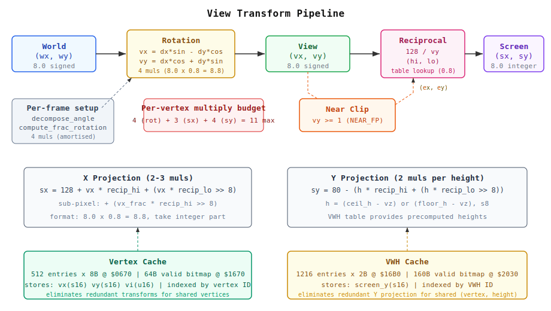

# Vertex Cache and View Transform Pipeline -- Technical Memo

## 1. Overview

The DOOM wireframe renderer transforms world-space vertices into screen-space
coordinates through a three-stage pipeline:

1. **Rotation** -- world coordinates to view-space via player-relative rotation
2. **Near clip** -- discard or clip edges that cross behind the camera
3. **Projection** -- perspective-divide view coords to screen pixels

All arithmetic is 8-bit. View-space coordinates are 8.0 signed integers.
Reciprocals are 0.8 unsigned fractions. Screen coordinates are 8.0 integers
(X: 0--255, Y: 0--159). Every multiply in the pipeline is an 8x8-bit operation
implemented via quarter-square table lookup on the 6502.

Two caches eliminate redundant work:

- **Vertex cache** -- stores view-space (vx, vy) and screen X per vertex ID,
  avoiding recomputation when multiple segs share a vertex.
- **VWH cache** -- stores projected screen Y per (vertex, height) pair,
  avoiding recomputation when adjacent segs share a sector's floor or ceiling.



### 1.1 Prescaling

All world coordinates are divided by `PRESCALE` (default 8) at WAD load time.
This reduces DOOM's 16-bit coordinate space (roughly -16384 to +16384) into
signed 8-bit range, so that view-space deltas `dx = wx - px` fit in a single
byte. The prescale factor is fixed at load time and baked into all vertex,
height, and player-position values. A factor of 16 is also supported (selected
via the `DOOM_PRESCALE` environment variable) which halves spatial precision but
guarantees all deltas fit strictly in s8.

**Source:** `fp.py` line 569: `PRESCALE = int(os.environ.get('DOOM_PRESCALE', '8'))`

---

## 2. View Transform

The view transform converts a prescaled world vertex `(wx, wy)` into
view-space `(vx, vy)` relative to the player's position and facing angle.
View-space `vy` points forward (into the screen); `vx` points right.

### 2.1 Player Position

The player position is stored in 8.8 fixed point as `(px_88, py_88)`.
The integer parts `(px_int, py_int)` are the s8 prescaled coordinates stored
in zero-page (`zp_px_int`, `zp_py_int`); the fractional parts `(px_lo, py_lo)`
represent the sub-unit offset within the prescaled grid.

**Source:** `doom_fe.asm` lines 52--55:
```
zp_px_int   = &10    ; s8  prescaled player x (integer part of 8.8)
zp_py_int   = &11    ; s8  prescaled player y
zp_px_lo    = &12    ; u8  fractional x (low byte of 8.8)
zp_py_lo    = &13    ; u8  fractional y
```

### 2.2 Angle Decomposition

The player angle is a single unsigned byte (0--255 = 0--360 degrees).
`decompose_angle` decomposes this into six values:

| Field       | Type | Meaning                            |
|-------------|------|------------------------------------|
| sin_mag     | u8   | |sin(angle)| in 0.8 format (0--255)|
| sin_neg     | u8   | 1 if sin < 0 (quadrants 2,3)      |
| sin_unity   | u8   | 1 if |sin| = 1.0 exactly           |
| cos_mag     | u8   | |cos(angle)| in 0.8 format         |
| cos_neg     | u8   | 1 if cos < 0                       |
| cos_unity   | u8   | 1 if |cos| = 1.0 exactly           |

The magnitude lookup uses a 64-entry quadrant table (`sin_mag_tbl`). Quadrants
1 and 3 mirror the index (`idx = 64 - idx`). A separate `sin_unity_tbl` flags
entries where `round(sin * 256) >= 256`, which activates a zero-multiply
passthrough path.

This decomposition avoids signed multiplies entirely: the 8x8 multiply always
operates on unsigned magnitude, and the sign is applied afterwards with a
conditional negate.

**Source:** `doom_fe.asm` `.decompose_angle` (line 612), `fp.py` `fp_sincos()` (line 163)

### 2.3 Fractional Rotation Compensation

Vertices have integer prescaled coordinates (8.0), but the player position has
a fractional part. The delta `(wx - px)` therefore has a fractional component
equal to `-px_lo`. Rather than handle this per vertex, `compute_frac_rotation`
precomputes the rotated fractional contribution once per frame:

```
dx_lo = (-px_lo) & 0xFF
dy_lo = (-py_lo) & 0xFF
frac_vx = frac_rot(dx_lo, sin) - frac_rot(dy_lo, cos)
frac_vy = frac_rot(dx_lo, cos) + frac_rot(dy_lo, sin)
```

where `frac_rot(lo, trig)` is `(lo * mag + 128) >> 8` with sign applied, or
just `lo` when `unity` is set. The result is a signed 16-bit value in 8.8
format. This costs up to 4 multiplies per frame.

**Source:** `doom_fe.asm` `.compute_frac_rotation` (line 715), `fp.py` `fp_view_context()` (line 362)

### 2.4 The Rotation

For each vertex `(wx, wy)`, the per-vertex `to_view` routine computes:

```
dx = wx - px_int          (s8 or s9 integer delta)
dy = wy - py_int

int_vx =  dx * sin - dy * cos       (each term via _rot_int: 8.8 result)
int_vy =  dx * cos + dy * sin

total_vx = int_vx + frac_vx         (add precomputed fractional part)
total_vy = int_vy + frac_vy
```

Each `_rot_int(d, mag, neg, unity)` call performs one 8x8 multiply (or zero
when unity/zero), producing a 16-bit result in 8.8 format. The total cost is
at most 4 multiplies per vertex.

The 6502 implementation (`to_view`, line 4640) operates on 24-bit intermediates
to preserve the fractional addition without overflow. The final results are
extracted by rounding the 24-bit total:

```
vx = (total_vx + 128) >> 8     (s16, typically fits s8)
vy = (total_vy + 128) >> 8     (s16)
vi = max(2, total_vy >> 7)     (u16, reciprocal index with 1 fractional bit)
```

The `vi` (vy_idx) value is `total_vy >> 7` -- one more bit of precision than
`vy` -- providing a fractional bit for reciprocal table interpolation.

**Source:** `doom_fe.asm` `.to_view` (line 4640), `fp.py` `fp_to_view()` (line 407)

---

## 3. Near Clip

### 3.1 Why Needed

Vertices behind the camera (`vy < 1` in prescaled units) produce undefined or
wildly incorrect projection results: dividing by zero or negative depth. Near
clipping ensures all projected vertices have `vy >= NEAR_FP`.

### 3.2 Algorithm

`NEAR_FP = 1` (one prescaled unit = 8 world units at PRESCALE=8).

Given edge endpoints `(vx1, vy1)` and `(vx2, vy2)`:

1. **Both behind** (`vy1 < 1` and `vy2 < 1`): reject entirely.
2. **Both in front** (`vy1 >= 1` and `vy2 >= 1`): pass through unchanged.
3. **One behind**: compute the intersection with `vy = NEAR_FP`:

```
t = (NEAR_FP - vy_behind) / (vy_front - vy_behind)      (0.8 via div16_8)
cx = vx_behind + t * (vx_front - vx_behind)              (8x8 multiply)
```

The clipped endpoint becomes `(cx, NEAR_FP)`, replacing the behind vertex.
The in-front vertex passes through unchanged.

The 6502 implementation uses `div16_8` for the parametric `t` (shifted
numerator for 0.8 result) and `mul_s16_u8` for the interpolation, keeping
the multiply size at 8x8.

**Source:** `doom_fe.asm` `.near_clip` (line 4767), `fp.py` `fp_near_clip()` (line 449)

---

## 4. Projection

### 4.1 Reciprocal Lookup

The perspective divide `focal / vy` is implemented as a table lookup. A single
512-entry reciprocal table stores `min(128 / vy, 0x7F.FF)` as a 16-bit value
split into hi (0.8) and lo (0.0.8) bytes:

```
recip_hi[i] = (128 * 256 / i) >> 8       for i in 1..512
recip_lo[i] = (128 * 256 / i) & 0xFF
```

The lookup index is `vi >> 1` (the integer part of the 9.1-format `vi`).
When the LSB of `vi` is set, the routine averages adjacent 16-bit entries
by adding `(hi[i]:lo[i])` and `(hi[i+1]:lo[i+1])` as a full 16-bit sum
then shifting right by 1. This doubles the effective resolution to 1024
entries without a multiply.

The 6502 `recip_lookup` routine (line 5025) has a fast path for indices
below 256 (absolute-indexed `LDA table,X`) and a slow path for 256--512
(indirect pointer access).

**Source:** `doom_fe.asm` `.recip_lookup` (line 5025), `fp.py` `fp_recip()` (line 223)

### 4.2 X Projection

Screen X is computed as:

```
sx = HALF_W + vx * recip_hi + (vx * recip_lo >> 8)
```

Two 8x8 multiplies. `HALF_W = 128` (half of 256-pixel-wide render target).
The `recip_lo` term adds fractional correction: multiply, then discard the
low byte to get a carry into the integer result.

A sub-pixel variant adds a third multiply using the fractional view-space X
(`vx_frac` from `to_view`):

```
sx = HALF_W + vx * recip_hi + (vx * recip_lo >> 8) + (vx_frac * recip_hi >> 8)
```

Three 8x8 multiplies. The sub-pixel correction improves accuracy for
vertices near the screen centre where the reciprocal is large.

The 6502 `recip_and_project_x1` (line 5233) uses `mul_s16_u8_s24` for
the `ex1 * rxh` and `ex1 * rxl` terms, then fuses the results with a
byte-shifted add.

**Source:** `doom_fe.asm` `.recip_and_project_x1` (line 5233), `fp.py` `fp_project_x()` (line 248)

### 4.3 Y Projection

Screen Y is computed for height deltas (ceiling minus eye height, floor minus
eye height):

```
sy = HALF_H - (height_delta * recip_hi + (height_delta * recip_lo >> 8))
```

Two 8x8 multiplies. `HALF_H = 80` (half of 160-pixel-tall render target).
Positive height deltas (ceiling above eye) project above centre (lower Y);
negative deltas project below. The aspect ratio (1.2x for non-square BBC
Micro pixels) is baked into height prescaling, not the focal length, so both
X and Y projection use the same reciprocal table.

**Source:** `doom_fe.asm` `.project_y_all` (line 5415), `fp.py` `fp_project_y()` (line 265)

### 4.4 The VWH Height Table

Each seg has up to 8 projected Y values (front ceil/floor at both endpoints,
back ceil/floor at both endpoints). Rather than store raw heights and compute
`height - vz` at runtime, the WAD packer precomputes a **VWH table**
(Vertex-With-Height) at load time.

Each VWH entry is a unique `(vertex_index, prescaled_height)` pair. The table
stores the prescaled height itself as a single s8 byte. At runtime, the
projection reads this height, subtracts `vz` (prescaled eye height), and
multiplies by the reciprocal.

Seg detail records store u16 indices into the VWH table for each of their
eight height slots:

| Offset | Field    | Meaning                        |
|--------|----------|--------------------------------|
| +4     | VWH_FT1  | Front ceiling at vertex 1      |
| +6     | VWH_FB1  | Front floor at vertex 1        |
| +8     | VWH_FT2  | Front ceiling at vertex 2      |
| +10    | VWH_FB2  | Front floor at vertex 2        |
| +12    | VWH_BT1  | Back ceiling at vertex 1       |
| +14    | VWH_BB1  | Back floor at vertex 1         |
| +16    | VWH_BT2  | Back ceiling at vertex 2       |
| +18    | VWH_BB2  | Back floor at vertex 2         |

Sharing VWH indices across segs means that adjacent segs referencing the same
sector (same floor/ceiling height) at the same vertex will hit the VWH cache,
avoiding redundant Y projection multiplies.

**Source:** `doom_wireframe.py` `_vwh()` (line 211), `wad_packed.py` lines 216--218

---

## 5. Vertex Cache

### 5.1 Purpose

Multiple segs often share the same vertex. In DOOM's BSP structure, a typical
vertex appears in 2--4 segs. Without caching, each seg would independently
run the view transform (4 muls) and X projection (2--3 muls) for each endpoint.
The vertex cache eliminates this redundancy: the first seg to touch a vertex
pays the full cost; subsequent segs get a cache hit for free.

### 5.2 Cache Structure

The cache is a flat array in RAM indexed by vertex ID:

| Address | Size    | Contents                                    |
|---------|---------|---------------------------------------------|
| `$0670` | 4096 B  | 512 entries x 8 bytes each                  |
| `$1670` | 64 B    | Valid bitmap (512 bits, 1 per vertex)        |

Each 8-byte cache entry:

| Offset | Field  | Type | Meaning                                    |
|--------|--------|------|--------------------------------------------|
| +0     | VC_VX  | s16  | View-space X (8.0, sign-extended to 16-bit)|
| +2     | VC_VY  | s16  | View-space Y (8.0, sign-extended)          |
| +4     | VC_VI  | u16  | vy_idx (9.1 reciprocal lookup index)       |
| +6     | VC_SX  | s16  | Reserved (Python extends tuple with sx)     |

The entry size is 8 bytes (power of 2) for fast index-to-offset computation:
`addr = vcache_base + idx * 8` via three left shifts.

### 5.3 Valid Bitmap

A 64-byte bitmap (512 bits) tracks which entries are populated. For vertex
index `v`:

- **Byte index:** `v >> 3` (with +32 if `v >= 256`)
- **Bit mask:** `bit_masks[v & 7]` (table at line 5390)

On cache hit, the six bytes (vx, vy, vi) are loaded directly into the
working zero-page slots. On miss, the entry is populated after `to_view`
completes.

### 5.4 Cache Invalidation

The entire valid bitmap is zeroed at the start of each frame (64 bytes,
line 534):

```asm
LDA #0
LDX #63
.clr_vcv
STA vcache_valid,X
DEX
BPL clr_vcv
```

The cache entries themselves are not cleared -- only the bitmap matters.

### 5.5 Python Implementation

In the Python reference renderer, the vertex cache is a simple list of
`None` or tuples:

```python
vcache = [None] * len(vertexes)
```

On first access, `fp_to_view()` is called and the result stored. The tuple
is extended with `(sx, rxh, rxl)` after X projection, so later segs sharing
the same unclipped vertex reuse both the transform and projection.

**Source:** `doom_fe.asm` `.xform_vertex_cached` (line 4420), `doom_wireframe.py` `fp_render_seg()` (line 894)

---

## 6. VWH Cache

### 6.1 Purpose

Y projection maps a (vertex, height) pair to a screen Y coordinate. Many segs
share the same front sector, meaning they project the same ceiling and floor
heights at shared vertices. The VWH cache stores these projected Y values,
keyed by VWH index.

### 6.2 Structure

| Address  | Size    | Contents                                    |
|----------|---------|---------------------------------------------|
| `$16B0`  | 2432 B  | 1216 entries x 2 bytes each                 |
| `$2030`  | 160 B   | Valid bitmap (up to 1280 entries)            |

Each entry is a single s16 value: the projected screen Y coordinate. 16 bits
are needed because off-screen projections (very close vertices with large height
deltas) can exceed the 0--159 visible range.

### 6.3 Invalidation and Bypass

The valid bitmap is cleared per frame (160 bytes, line 542). Near-clipped
endpoints bypass the VWH cache because their reciprocal differs from the
original vertex's cached reciprocal.

### 6.4 Python Implementation

```python
vwh_cache = [None] * len(vwh_table)
```

On first access, `fp_project_y(ch - vz, ryh, ryl)` is called and the result
stored. Subsequent segs with the same VWH index (same vertex at the same
sector height) get the cached value directly.

**Source:** `doom_fe.asm` lines 218--219, `doom_wireframe.py` `fp_render_seg()` (line 961)

---

## 7. Precision Analysis

### 7.1 Format Summary

| Stage              | Quantity      | Format | Range                |
|--------------------|---------------|--------|----------------------|
| World coords       | wx, wy        | 8.0 s  | -128..+127 prescaled |
| Player position    | px, py        | 8.8 s  | integer + fraction   |
| View delta (int)   | dx, dy        | 8.0 s  | -255..+255           |
| Trig magnitudes    | sin, cos      | 0.8 u  | 0..255               |
| Rotation product   | d * trig      | 8.8 s  | via 8x8 mul          |
| View coords        | vx, vy        | 8.0 s  | after >>8 rounding   |
| Reciprocal index   | vi            | 9.1 u  | total_vy >> 7        |
| Reciprocal         | recip_hi      | 0.8 u  | 0..127               |
| Reciprocal (frac)  | recip_lo      | 0.0.8 u| 0..255               |
| Screen X           | sx            | 8.0 s  | 0..255               |
| Screen Y           | sy            | 8.0 s  | 0..159               |
| Height delta       | ch-vz, fh-vz  | 8.0 s  | -31..+31 typical     |
| Near-clip param    | t             | 0.8 u  | 0..255               |

### 7.2 Key Multiplies

The entire per-vertex pipeline uses at most **9 multiplies** (all 8x8):

| Stage                | Multiply                      | Count |
|----------------------|-------------------------------|-------|
| Rotation (integer)   | dx * sin, dx * cos, dy * sin, dy * cos | 4 |
| X projection         | vx * recip_hi, vx * recip_lo | 2     |
| X sub-pixel          | vx_frac * recip_hi            | 1     |
| Y projection (x2)    | h * recip_hi, h * recip_lo    | 2     |

Plus 4 multiplies per frame for fractional rotation (amortised to zero
per vertex).

### 7.3 Precision Limits

The prescale factor determines the spatial resolution:

- **PRESCALE=8:** 1 prescaled unit = 8 world units. The viewable depth range
  is 1--127 prescaled units (8--1016 world units). View deltas can reach s9
  in rare cases (requiring the `mul_s16_u8_s24` wide path).

- **PRESCALE=16:** 1 prescaled unit = 16 world units. All deltas fit strictly
  in s8. The viewable depth range is 1--63 prescaled units.

The reciprocal table covers depths 1--512 in integer steps with 1-bit
fractional interpolation (1024 effective entries). For `vy = 1` (closest
possible), `recip = 128` (0.8), giving maximum magnification. For `vy = 128`,
`recip = 1`, giving 1:1 mapping.

Screen X precision is inherently limited to integer pixels (8.0). The sub-pixel
correction term (`vx_frac * recip_hi >> 8`) adds up to 1 pixel of adjustment,
which matters most at close range where the reciprocal is large.

### 7.4 Aspect Ratio

The render target is 256x160 pixels. On the BBC Micro's MODE 2 display, pixels
are taller than they are wide (aspect ratio 1.2:1). Rather than using separate
X and Y focal lengths (which would require two reciprocal tables), the 1.2x
aspect correction is baked into the height prescaling at load time. This allows
a single reciprocal table (`FOCAL_X = 128`) for both X and Y projection.

```
FP_RENDER_W = 256     HALF_W = 128     FP_FOCAL_X = 128
FP_RENDER_H = 160     HALF_H = 80      ASPECT = 6/5 = 1.2
```

**Source:** `fp.py` lines 196--204
